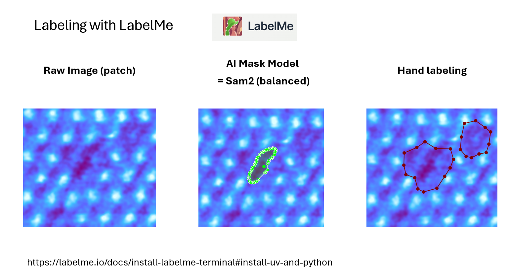
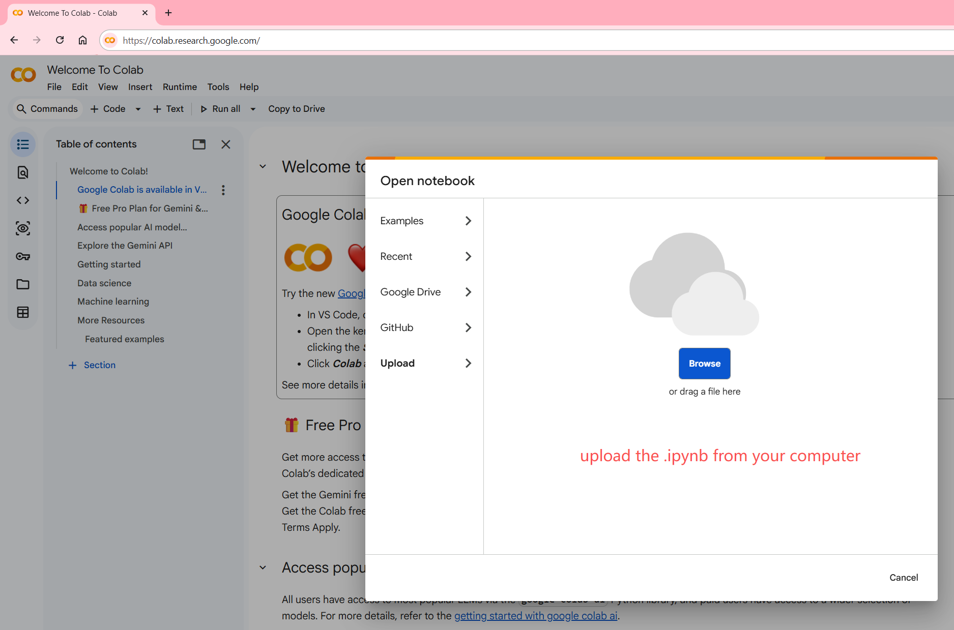
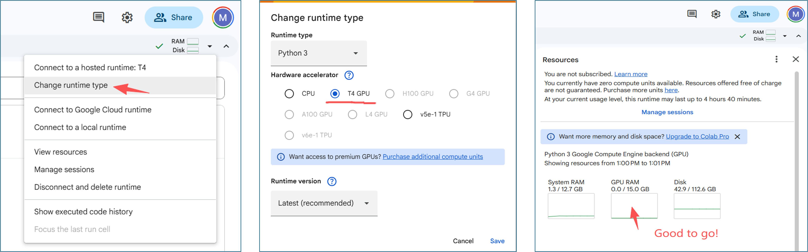
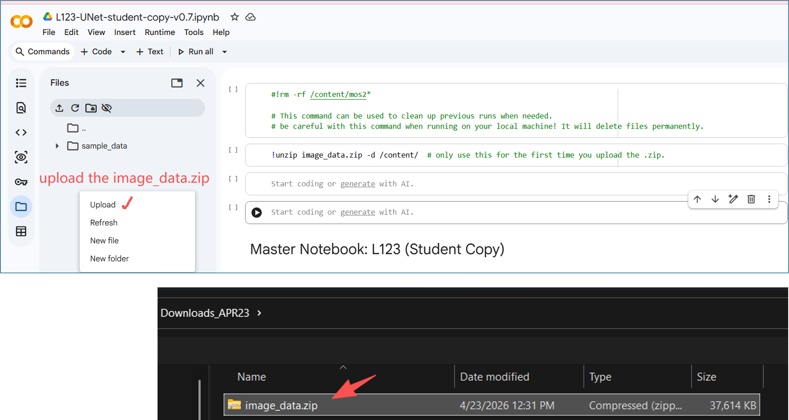
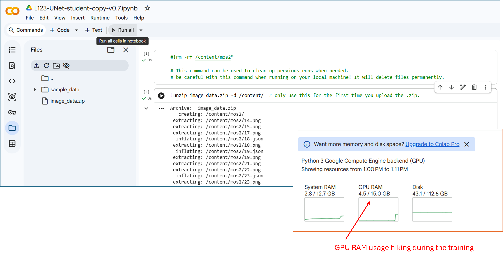
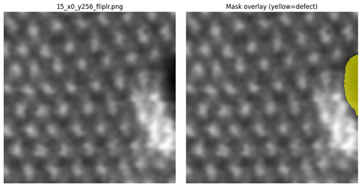
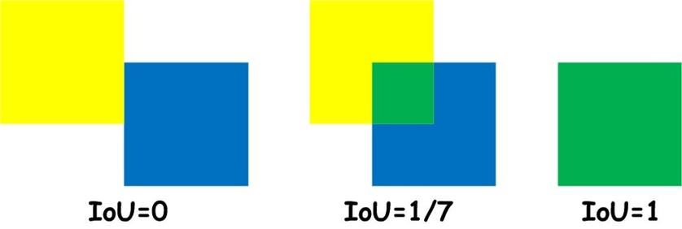
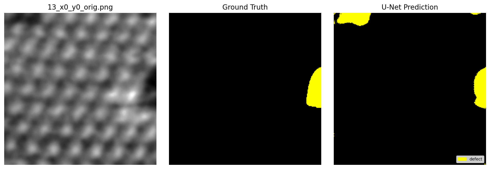
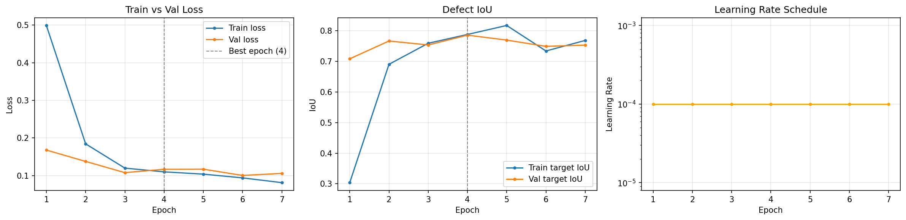

# MSE544 Image Segmentation with U-Net

A hands-on tutorial for **MSE544 (Spring 2026)** that walks students through a complete image-segmentation workflow using **U-Net**, applied to a real materials-science dataset of **MoS₂** scanning transmission electron microscopy (STEM) images. The goal is to identify and mask out **defects (voids)** in the material.

**Instructors:** Huilong (Max) Fu, Prof. Luna Huang, Andrew Scott

---

## Learning Objectives

- What is image segmentation?
- What is the U-Net architecture?
- What is the typical workflow of image segmentation with a simple case study in materials science from scratch? (defect segmentation in MoS2 STEM images)
- How to build a U-net model in python, and what are the key hyperparameters?
- How to improve image segmentation results — both numerically (IoU) and visually (mask quality)?

---

## Repository Contents

| Path                                                                | Description                                                     |
| ------------------------------------------------------------------- | --------------------------------------------------------------- |
| [L123-UNet-student-copy-v0.7.ipynb](L123-UNet-student-copy-v0.7.ipynb) | Student notebook — contains 8 questions + improvement section  |
| [image_data.zip](image_data.zip)                                       | Zipped dataset for quick upload to Google Colab                 |
| mos2/                                                               | 10 Training images + 5 labels (the other 5 labels were removed) |
| mos2_additional_training_labels/                                    | Extra training labels you can add back to "mos2/"               |
| mos2_val_images_labeled/                                            | Fixed validation set (3 labeled images)                         |
| mos2_test_images_unlabeled/                                         | Unlabeled test images (14 images)                               |

---

## 1. Introduction of Image Segmentation

In digital image processing and computer vision, image segmentation is the process of partitioning a digital image into multiple image segments, also know as image regions or image objects (sets of pixels). The goal of segmentation is to simplify and/or change the representation of an image into something that is more meaningful and easier to analyze.
Source:
https://en.wikipedia.org/wiki/Image_segmentation

---

## 2. U-Net architecture and workflow

U-Net is a convolutional neural network (CNN) that was developed for image segmentation. As shown in Figure 1, this network is modified to have symmetrical down sampling and up sampling layers in a U-shaped architecture. Notice that there are skip connections (gray arrows) between those two sides to provide more context from the input.

Ronneberger, O., Fischer, P., & Brox, T. (2015). U-net: Convolutional networks for biomedical image segmentation. International Conference on Medical image computing and computer-assisted intervention.
Source:
https://lmb.informatik.uni-freiburg.de/people/ronneber/u-net/

  
   
  <em>U-Net architecture and workflow</em>

---

## 3. Case Study - MoS₂ image dataset

The **MoS₂ image dataset** (28 raw STEM images) was provided by **Professor Juan C. Idrobo** as part of the MSE544 Y2025 hackathon challenge. The segmentation task is binary: **defect (void)** vs **background**.

  
   
  <em>A sample raw MoS₂ STEM image — dark regions are the defects (voids) we want to segment.</em>

| Split                 | Folder                                | Count                           |
| --------------------- | ------------------------------------- | ------------------------------- |
| Training              | `./mos2`                            | 10 images (some labels removed) |
| Extra training labels | `./mos2_additional_training_labels` | 2 additional `.json` labels   |
| Validation (fixed)    | `./mos2_val_images_labeled`         | 3 labeled images                |
| Test (unlabeled)      | `./mos2_test_images_unlabeled`      | 14 images                       |

---

## 4. Workflow of a simple segmentation task using U-Net

1). **Manual labeling** of raw MoS₂ images with [LabelMe](https://labelme.io/docs/install-labelme-terminal#install-uv-and-python) (free version includes `sam2` AI assist).

  

2). **Upload** the dataset and notebook to [Google Colab](https://colab.research.google.com/); select a **free Nvidia T4 GPU**.

*(a) Open/Upload the Jupyter notebook first*

  

*(b) Change runtime type to select a Nvidia T4 GPU*

  

*(c) Upload the image-data.zip, and unzip*

  

*(d) Run the code*

  

3). **Preprocessing**

- **Train / validation split**
  - There are 10 images in the training image folder `./mos2`, but some labels are removed. However, 2 more training labels are provided in the folder `./mos2_additional_training_labels`. You can try to add them back to `./mos2` and see if that improves the U-Net training.
  - There are 3 images in the validation image folder `./mos2_val_images_labeled`.
  - There are 10+ more images in `./mos2_test_images_unlabeled`.
- Crop raw images into smaller patches
- Convert labels: `.json` → `.png` segmentation masks
- Data augmentation (flip, rotation, …) — training patches only

  
   
  <em>Training image (small patch) and Mask (hand label)</em>

4). **U-Net training & validation**

- Load training patches and masks
- Define U-Net architecture and hyperparameters
- Define the loss function (CrossEntropy, Dice, …)
- Evaluate with **IoU** (Intersection-over-Union)

  
   
  <em>Segmentation Metric — Intersection over Union (IoU).</em>
   
  Source: https://towardsdatascience.com/intersection-over-union-iou-calculation-for-evaluating-an-image-segmentation-model-8b22e2e84686/

- Visualize training curves and predictions (validation + unlabeled test images)

  
   
  <em>Validation patch — raw image, ground-truth mask, and U-Net prediction</em>

  
   
  <em>Baseline training history — train/val loss, defect IoU, and learning-rate schedule</em>

---

## 5. Prediction on unlabeled test images

  
   
  <em>Prediction on unlabeled test image</em>

---

## 6. Assignment & Grading (100 pts)

### Questions & Answering — 8 × 10 pts = **80 pts**

1. Why do we need **train-validation-split** before U-Net training?
2. Why crop original images into **smaller patches**?
3. Why is **image augmentation** needed, and what other methods could be used?
4. How do we address the **class imbalance** (background ≫ defect)?
5. Explain the **U-Net architecture & skip connections**, and why they are crucial for pixel-wise segmentation.
6. Describe the **loss function(s)** and **evaluation metric(s)** used in this notebook.
7. What are the key **hyperparameters** you can fine-tune to improve performance?
8. **Evaluate** the current training history and test results — is it good? If not, how can it be improved?

### Improvement — **20 pts**

Apply your improvement plan from Q8 (modify code, label more images, tune hyperparameters, etc.) and re-run. Points are awarded based on how much your final **defect IoU** exceeds the baseline, and on the visual cleanliness of predicted masks on the unlabeled test images.

### Submission

- Upload your updated `.ipynb` with every question answered in the Jupyter notebook markdown cells(80%).
- U-Net performance improved with new results shown in the notebook (20%).

---

## Optional TA Demos *(not required for students)*

- **LabelMe AI labeling** with `sam2` (Segment Anything Model 2 from Meta).

---

## References

- Ronneberger, O., Fischer, P., & Brox, T. (2015). *U-Net: Convolutional Networks for Biomedical Image Segmentation*. MICCAI. [https://lmb.informatik.uni-freiburg.de/people/ronneber/u-net/](https://lmb.informatik.uni-freiburg.de/people/ronneber/u-net/)
- Wikipedia — [Image segmentation](https://en.wikipedia.org/wiki/Image_segmentation)
- Towards Data Science — [Intersection over Union (IoU)](https://towardsdatascience.com/intersection-over-union-iou-calculation-for-evaluating-an-image-segmentation-model-8b22e2e84686/)
- LabelMe — [https://labelme.io/docs/install-labelme-terminal#install-uv-and-python](https://labelme.io/docs/install-labelme-terminal#install-uv-and-python)

---

## Acknowledgements

- **Professor Juan C. Idrobo** — MoS₂ dataset (MSE544 Y2025 hackathon)
