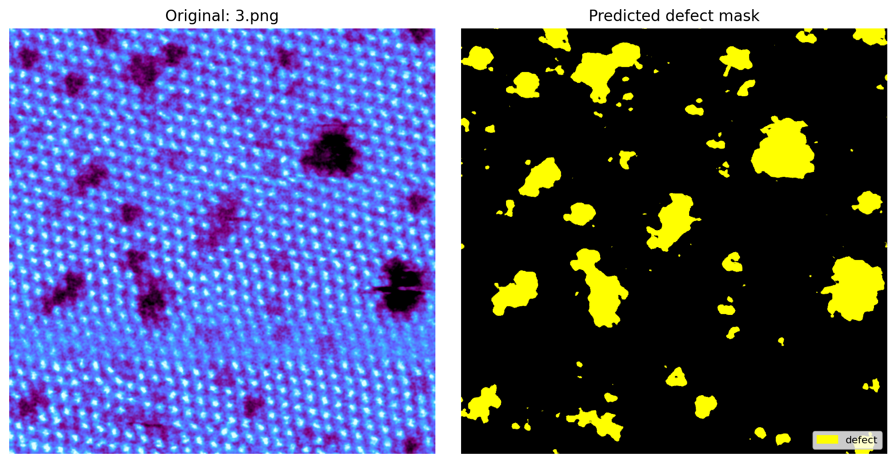

# MSE544 Computer Vision — Image Segmentation with U-Net

A hands-on tutorial for **MSE544 (Spring 2026)** that walks students through a complete image-segmentation workflow using **U-Net**, applied to a real materials-science dataset of **MoS₂** scanning transmission electron microscopy (STEM) images. The goal is to identify and mask out **defects (voids)** in the material.

**Instructor / TA:** Max Fu, Luna Huang, Andrew Scott

<p align="center">
  
  <br/>
  <em>U-Net predicted defect mask on an unlabeled MoS₂ test image.</em>
</p>

---

## Learning Objectives

- What is image segmentation?
- What is the U-Net architecture?
- What is the typical workflow of image segmentation with a simple case study in materials science from scratch? (defect segmentation)
- How to improve image segmentation results — both numerically (IoU) and visually (mask quality)?

---

## Repository Contents

| Path | Description |
| --- | --- |
| [L123-UNet-student-copy-v0.7.ipynb](L123-UNet-student-copy-v0.7.ipynb) | Student notebook — contains 8 questions + improvement section |
| [L123-UNet-instructor-copy-v0.7.ipynb](L123-UNet-instructor-copy-v0.7.ipynb) | Instructor reference solution |
| [teaching-plan.pdf](teaching-plan.pdf) | Full teaching plan and assignment brief |
| [mos2/](mos2/) | Training images + labels (some labels intentionally removed) |
| [mos2_additional_training_labels/](mos2_additional_training_labels/) | Extra training labels students can add back |
| [mos2_val_images_labeled/](mos2_val_images_labeled/) | Fixed validation set (3 labeled images) |
| [mos2_test_images_unlabeled/](mos2_test_images_unlabeled/) | Unlabeled test images (14 images) |
| [image_data.zip](image_data.zip) | Zipped dataset for quick upload to Colab |
| [build_student_nb.py](build_student_nb.py) | Script used to build the student notebook from the instructor copy |

---

## Dataset

The **MoS₂ image dataset** (28 raw STEM images) was provided by **Professor Juan C. Idrobo** as part of the MSE544 Y2025 hackathon challenge. The segmentation task is binary: **defect (void)** vs **background**.

<p align="center">
  
  <br/>
  <em>A sample raw MoS₂ STEM image — dark regions are the defects (voids) we want to segment.</em>
</p>

| Split | Folder | Count |
| --- | --- | --- |
| Training | `./mos2` | 10 images (some labels removed) |
| Extra training labels | `./mos2_additional_training_labels` | 2 additional `.json` labels |
| Validation (fixed) | `./mos2_val_images_labeled` | 3 labeled images |
| Test (unlabeled) | `./mos2_test_images_unlabeled` | 14 images |

---

## Workflow

1. **Manual labeling** of raw MoS₂ images with [LabelMe](https://labelme.io/docs/install-labelme-terminal#install-uv-and-python) (free version includes `sam2` AI assist).
2. **Upload** the dataset and notebook to [Google Colab](https://colab.research.google.com/); select a **free Nvidia T4 GPU**.
3. **Preprocessing**
   - Train / validation split
   - Crop raw images into smaller patches
   - Convert labels: `.json` → `.png` segmentation masks
   - Data augmentation (flip, rotation, …) — training patches only
4. **U-Net training & validation**
   - Load training patches and masks
   - Define U-Net architecture and hyperparameters
   - Define loss (CrossEntropy, Dice, …)
   - Evaluate with **IoU** (Intersection-over-Union)
   - Visualize training curves and predictions (validation + unlabeled test images)

<p align="center">
  
  <br/>
  <em>Validation patch — raw image, ground-truth mask, and U-Net prediction side-by-side.</em>
</p>

<p align="center">
  
  <br/>
  <em>Baseline training history — train/val loss, defect IoU, and learning-rate schedule.</em>
</p>

---

## Getting Started

```bash
# 1. Clone the repo
git clone <this-repo-url>
cd 544-Lexar-2026Apr9-Unet-v0.7

# 2. Open the student notebook in Google Colab
#    Runtime -> Change runtime type -> T4 GPU -> Save

# 3. Upload image_data.zip (or the dataset folders) to the Colab session
#    and run the notebook top-to-bottom.
```

---

## Assignment & Grading (100 pts)

### Questions & Answering — 8 × 10 pts = **80 pts**

1. Why do we need **train-test-split** before U-Net training?
2. Why crop original images into **smaller patches**?
3. Why is **image augmentation** needed, and what other methods could be used?
4. How do we address the **class imbalance** (background ≫ defect)?
5. Explain the **U-Net architecture & skip connections**, and why they are crucial for pixel-wise segmentation.
6. Describe the **loss function(s)** and **evaluation metric(s)** used in this notebook.
7. What are the key **hyperparameters** you can fine-tune to improve performance?
8. **Evaluate** the current training history and test results — is it good? If not, how can it be improved?

### Improvement — **20 pts**

Apply your improvement plan from Q8 (modify code, label more images, tune hyperparameters, etc.) and re-run. Points are awarded based on how much your final **defect IoU** exceeds the baseline, and on the visual cleanliness of predicted masks on the unlabeled test images.

### Submission

- Upload your updated `.ipynb` with every question answered (80%).
- U-Net performance improved with new results shown in the notebook (20%).

---

## Optional TA Demos *(not required for students)*

- **LabelMe AI labeling** with `sam2` (Segment Anything Model 2, Meta).
- **YOLOv11-based AI labeling assistant** — cuts manual labeling time roughly in half.

---

## References

- Ronneberger, O., Fischer, P., & Brox, T. (2015). *U-Net: Convolutional Networks for Biomedical Image Segmentation*. MICCAI. <https://lmb.informatik.uni-freiburg.de/people/ronneber/u-net/>
- Wikipedia — [Image segmentation](https://en.wikipedia.org/wiki/Image_segmentation)
- Towards Data Science — [Intersection over Union (IoU)](https://towardsdatascience.com/intersection-over-union-iou-calculation-for-evaluating-an-image-segmentation-model-8b22e2e84686/)
- LabelMe — <https://labelme.io/docs/install-labelme-terminal#install-uv-and-python>

---

## Acknowledgements

- **Professor Juan C. Idrobo** — MoS₂ dataset (MSE544 Y2025 hackathon)
- **Max Fu** — TA, teaching materials, and notebook
