# Computer Vision: Image Segmentation using U-Net

**Authors: Huilong (Max) Fu, Prof. Luna Huang, Andrew Scott**

**Date: Spring 2026**

This is a tutorial prepared for the University of Washington **MSE544 — Computer Vision in Materials Science** hands-on class. In this tutorial, students will learn the fundamentals of image segmentation and the U-Net architecture; how to build a complete defect-segmentation pipeline from raw STEM images of MoS₂ — including labeling with LabelMe, dataset preparation, U-Net training on a free Nvidia T4 GPU on Google Colab, and inference on unlabeled test images; and how to iteratively improve segmentation performance through augmentation, loss design, hyperparameter tuning, and additional labeling (= adding more training data). Potential applications using this U-Net segmentation model on this MoS2 dataset are also discussed.

**Before you start**, please download the **image_data.zip** from the Canvas page. After unzipping in a project folder, your folder content should look like this:

```text
├── image_data.zip
├── mos2
│   ├── 14.png
│   ├── 15.png
│   ├── 17.png
│   ├── 18.json
│   ├── 18.png
│   ├── 19.json
│   ├── 19.png
│   ├── 21.png
│   ├── 22.png
│   ├── 23.json
│   ├── 23.png
│   ├── 26.json
│   ├── 26.png
│   ├── 28.json
│   └── 28.png
├── mos2_additional_training_labels
│   ├── 21.json
│   └── 22.json
├── mos2_test_images_unlabeled
│   ├── 10.png
│   ├── 11.png
│   ├── 12.png
│   ├── 16.png
│   ├── 2.png
│   ├── 20.png
│   ├── 24.png
│   ├── 3.png
│   ├── 4.png
│   ├── 5.png
│   ├── 6.png
│   ├── 7.png
│   ├── 8.png
│   └── 9.png
└── mos2_val_images_labeled
    ├── 13.json
    ├── 13.png
    ├── 25.json
    ├── 25.png
    ├── 27.json
    └── 27.png
```

## From Tabular Data to Image Data

In week3 of this quarter, we introduced the CatBoost for numerical regression and feature importance analysis using tabular data. This time, we are exploring how to use deep neural networks (e.g. U-Net) in image learning tasks.

Image data breaks the assumptions you're used to from tabular ML, and almost every design choice in this notebook (U-Net, Dice loss, class weights, augmentation) traces back to one of three differences:

1. **Higher dimensionality** — a 256×256 grayscale image is 65,536 numbers, vs. tens of features in a typical table. Treating each pixel as an independent feature blows up parameter counts (motivating **convolutions**, which share weights across the image) and squares the class-imbalance problem (defects cover ~2% of pixels, so naive accuracy is meaningless — motivating **Dice/weighted losses**).
2. **Spatial proximity matters** — shuffling columns in a table changes nothing, but a pixel is meaningful only because of its neighbors. **Convolutions** exploit local neighborhoods, and U-Net's **skip connections** preserve fine spatial detail that would otherwise be lost at the bottleneck.
3. **The output is also an image** — semantic segmentation needs a class label *per pixel*, same shape as the input. Standard CNN classifiers (which compress to one vector) won't work; U-Net is built to compress *and* re-expand back to full resolution.

You might have no idea about any of these comparisons at this moment, but soon you will have better and deeper understanding from this rich hands-on experience.

## Data & Code Policy

> **The MoS₂ image dataset provided by Professor Juan C. Idrobo and the tutorial code (notebook, helper scripts, README) are made available for the sole use of students enrolled in MSE 544.** You may **NOT** redistribute, repost, publish, or share the dataset or code — in whole or in part, in any form (including public GitHub repositories, personal websites, blog posts, presentations outside of class, or third-party AI/ML platforms) — without **prior written approval from the instruction team**. If you'd like to use any of this material outside of the course, please contact the instructors first.

## Table of Contents

[Learning Objectives](#learning-objectives)

[Background](#background)

- [1. Image Segmentation](#1-image-segmentation)
- [2. U-Net Architecture](#2-u-net-architecture)
- [3. Case Study — MoS₂ Image Dataset](#3-case-study--mos-image-dataset)
- [4. Dataset Folder Layout from image_data.zip](#4-dataset-folder-layout-from-image_datazip)
- [5. Hands-on Workflow Overview](#5-hands-on-workflow-overview)

[Install LabelMe (for hand labeling)](#install-labelme-for-hand-labeling)

- [Step A. Install uv](#step-a-install-uv)
- [Step B. Install Python via uv](#step-b-install-python-via-uv)
- [Step C. Install and launch LabelMe](#step-c-install-and-launch-labelme)
- [Step D. Label your images](#step-d-label-your-images)
- [Step E. Re-package labels and upload to Colab](#step-e-re-package-labels-and-upload-to-colab)

[Local Setup (if running on your own computer)](#local-setup-if-running-on-your-own-computer)

- [Step A. Install Miniconda and create a new environment](#step-a-install-miniconda-and-create-a-new-environment)
- [Step B. Install PyTorch and dependencies](#step-b-install-pytorch-and-dependencies)
- [Step C. Create a new notebook in VS Code and follow the tutorial](#step-c-create-a-new-notebook-in-vs-code-and-follow-the-tutorial)

[Setup of Google Colab](#setup-of-google-colab)

- [Step A. Optional cleanup (skip on first run)](#step-a-optional-cleanup-skip-on-first-run)
- [Step B. Optional unzip (run once)](#step-b-optional-unzip-run-once)
- [Step C. Check PyTorch and GPU](#step-c-check-pytorch-and-gpu)

[Part 1 — Dataset Preparation](#part-1--dataset-preparation)

- [Step A. Settings](#step-a-settings)
- [Step B. Output folder structure](#step-b-output-folder-structure)
- [Step C. Mask helper from LabelMe JSON](#step-c-mask-helper-from-labelme-json)
- [Step D. Augmentation helpers](#step-d-augmentation-helpers)
- [Step E. Collect image/json pairs](#step-e-collect-imagejson-pairs)
- [Step F. Train / val split](#step-f-train--val-split)
- [Step G. Patch extraction + dataset generation](#step-g-patch-extraction--dataset-generation)
- [Step H. Sanity-check visualisation](#step-h-sanity-check-visualisation)
- [Step I. Class balance stats](#step-i-class-balance-stats)

[Part 2 — U-Net Training](#part-2--u-net-training-binary-defect-segmentation)

- [Step A. Print labeled MoS2 image IDs](#step-a-print-labeled-mos2-image-ids)
- [Step B. (Optional) Install dependencies](#step-b-optional-install-dependencies)
- [Step C. MoS2 Dataset (`Dataset` + `DataLoader`)](#step-c-mos2-dataset-dataset--dataloader)
- [Step D. Create the U-Net model](#step-d-create-the-u-net-model)
- [Step E. Class weights and loss (Focal CE + optional focal Tversky)](#step-e-class-weights-and-loss-focal-ce--optional-focal-tversky)
- [Step F. Pick device](#step-f-pick-device)
- [Step G. Training loop](#step-g-training-loop)
- [Step H. Plot training curves (training history)](#step-h-plot-training-curves-training-history)
- [Step I. Visualise val predictions](#step-i-visualise-val-predictions)
- [Step J. Per-class IoU on validation set](#step-j-per-class-iou-on-validation-set)

[Part 3 — U-Net Prediction on Unlabeled Test Images](#part-3--u-net-prediction-on-unlabeled-test-images)

- [Step A. Imports + paths](#step-a-imports--paths)
- [Step B. Re-define U-Net (standalone for inference)](#step-b-re-define-u-net-standalone-for-inference)
- [Step C. Load weights](#step-c-load-weights)
- [Step D. Prediction helpers](#step-d-prediction-helpers)
- [Step E. Run predictions on unlabeled images #2–12](#step-e-run-predictions-on-unlabeled-images-212)

[Questions &amp; Answering](#questions--answering-8--10-pts--80-pts)

[Disclaimer](#disclaimer)

## Learning Objectives

- What is image segmentation?
- What is U-Net architecture?
- What is the typical workflow of image segmentation with a simple case study in materials science from scratch (defect segmentation)?
- How to improve image segmentation results, both numerically and visually?

---

## Background

### 1. Image Segmentation

In digital image processing and computer vision, image segmentation is the process of partitioning a digital image into multiple image segments (also known as image regions or image objects — sets of pixels). The goal of segmentation is to simplify and/or change the representation of an image into something more meaningful and easier to analyze.

Reference: [https://en.wikipedia.org/wiki/Image_segmentation](https://en.wikipedia.org/wiki/Image_segmentation)

**Intersection over Union (IoU)** is known to be a good metric for measuring overlap between two bounding boxes or masks. If the prediction is completely correct, IoU =1. The lower the IoU, the worse the prediction results. An illustration of IoU concept is shown below:

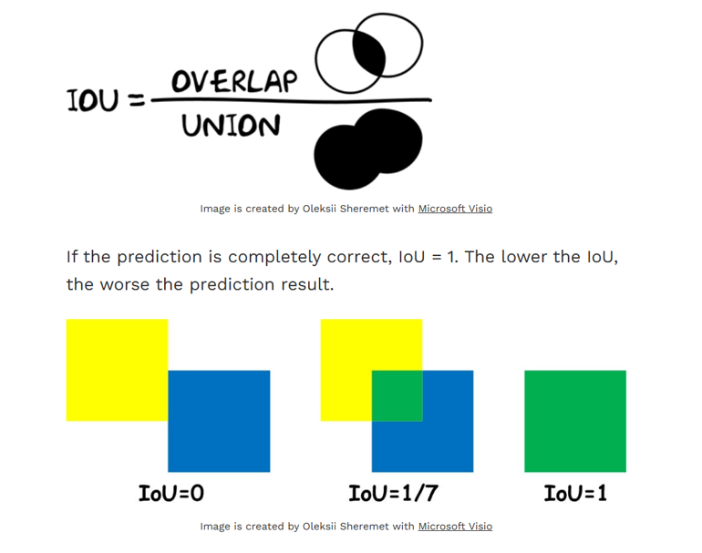

For an IoU primer, see: [https://towardsdatascience.com/intersection-over-union-iou-calculation-for-evaluating-an-image-segmentation-model-8b22e2e84686/](https://towardsdatascience.com/intersection-over-union-iou-calculation-for-evaluating-an-image-segmentation-model-8b22e2e84686/)

### 2. U-Net Architecture

U-Net is a convolutional neural network (CNN) developed for image segmentation. It has symmetrical down-sampling (encoder) and up-sampling (decoder) layers in a U-shaped architecture, with **skip connections** between the two sides to preserve spatial context from the input. This makes it well-suited for pixel-wise segmentation, especially with limited training data.

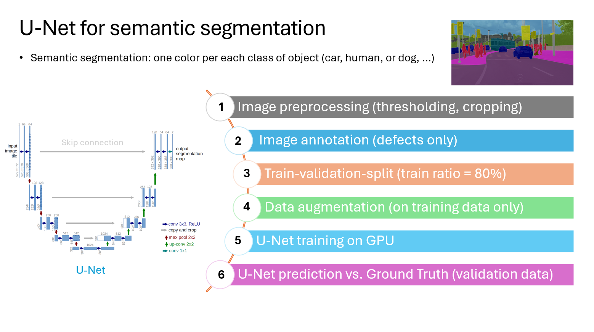

Reference: Ronneberger, O., Fischer, P., & Brox, T. (2015). *U-Net: Convolutional networks for biomedical image segmentation.* MICCAI.
[https://lmb.informatik.uni-freiburg.de/people/ronneber/u-net/](https://lmb.informatik.uni-freiburg.de/people/ronneber/u-net/)

### 3. Case Study — MoS₂ Image Dataset

The MoS₂ image dataset (28 raw images) was provided by **Professor Juan C. Idrobo** as part of the Y2025 hackathon challenge for this same class. The simple segmentation task in this assignment is to **identify and mask out all the defects (voids, shown as black regions in the raw images)**.

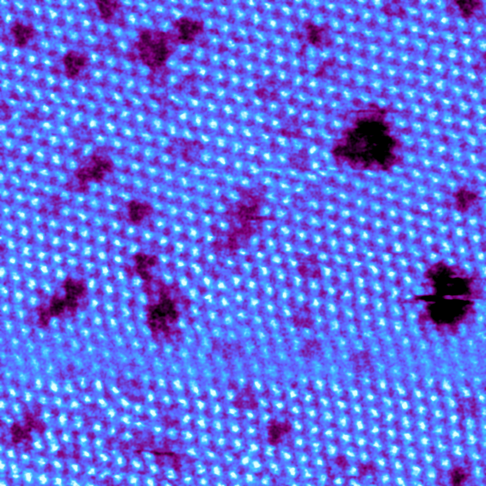

A free labeling tool, **LabelMe**, is introduced for hand labeling, with optional AI assistance via `sam2` (Segment Anything Model 2):
[https://labelme.io/docs/install-labelme-terminal#install-uv-and-python](https://labelme.io/docs/install-labelme-terminal#install-uv-and-python)

For context, here is what individual MoS₂ point defects look like at higher magnification (the dark voids the U-Net needs to learn):

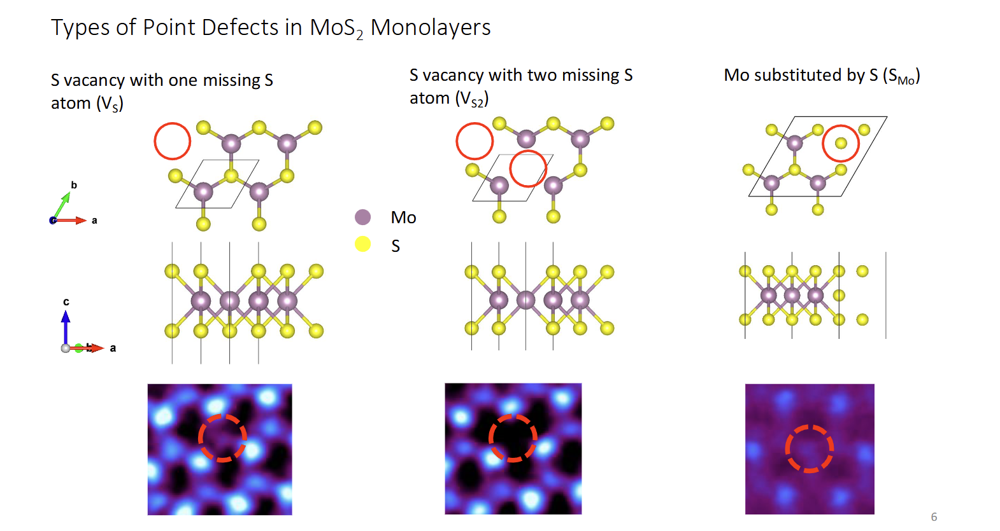

A more advanced version of this segmentation task is to distinguish multiple defect types at once (mono-vacancy, di-vacancy, etc.) — useful as a stretch goal once the binary defect/background model is working:

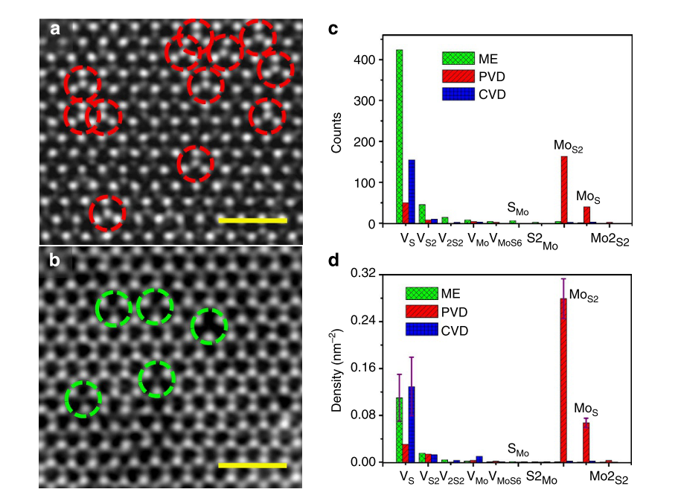

Hong et al. (2015). Exploring atomic defects in molybdenum disulphide monolayers. Nature Communications, 6(1), 6293. https://doi.org/10.1038/ncomms7293

**It is worth mentioning that multi-class segmentation and classification is very complicated in practice. Many companies or research groups still heavily rely on human experts to manually identify, classify and count the different defects.**

An example of defect segmentation with **2 classes** (2 different types of defects) is provided below:

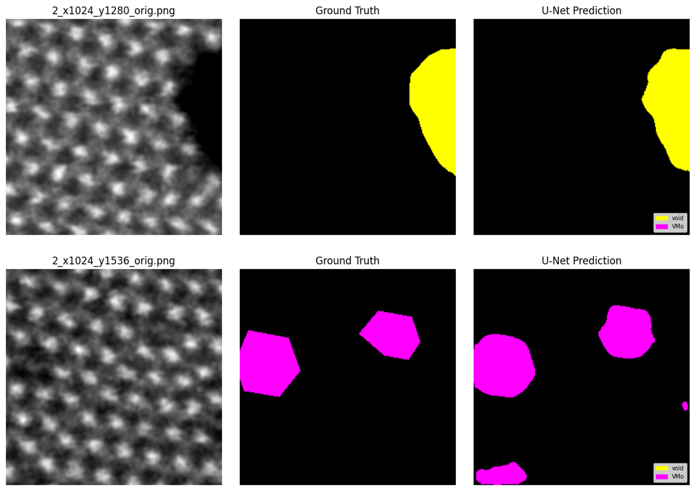

**For the simplicity of this 101-level segmentation hands-on, we will only do segmentaion for the obvious voids with just 1 class label "defect".**

An example is given below:


**Potential applications from this simple 1-class segmentation:**

- Identify and measure the void content (percentage) for quality control purposes.
- Deploy as a fast pre-screening tool to extract all the defects, and then do classfication and counting of different defect types.
- Provide information to calculate electrical or thermal properties of this material (MoS2 monolayer).
- Provide a simple educational tool and others.

### 4. Dataset Folder Layout from image_data.zip

| Folder                                | Contents                                                                                   |
| ------------------------------------- | ------------------------------------------------------------------------------------------ |
| `./mos2`                            | 10 training images + 5 training labels (the other 5 labels were intentionally removed)     |
| `./mos2_additional_training_labels` | 2 extra training labels — try adding them back to `./mos2` to see if training improves. |
| `./mos2_val_images_labeled`         | 3 fixed validation images (used to evaluate your optimisation).                            |
| `./mos2_test_images_unlabeled`      | 10+ unlabeled test images for final qualitative evaluation.                                |

### 5. Hands-on Workflow Overview

1. **Manual labeling** of raw MoS₂ images via the LabelMe desktop app. (Some training/validation labels are pre-provided by TA Max Fu.)
2. **Create a new Jupyter notebook on Google Colab**, then change the runtime to a free **Nvidia T4 GPU** (`Runtime → Change runtime type → T4 GPU`). **Upload** the image dataset (image_data.zip) to **Google Colab**, and selectively copy-paste the code cells from this tutorial.
3. **Image preprocessing**: train/val split, crop into smaller patches, convert LabelMe `.json` → `.png` masks, and apply augmentation (flip, rotation, …) to **training patches only**.
4. **U-Net training & validation**: load patches, define the model and hyperparameters, choose a loss (CrossEntropy, Dice, …), and evaluate using **IoU (Intersection over Union)**. Visualise training history, validation predictions vs ground truth, and predictions on unlabeled test images.
5. **Analyze** validation/test results, answer the 8 questions, then apply your improvement plan and re-run.

---

## Install LabelMe (for hand labeling)

Before training, the raw MoS₂ images need to be hand-labeled with polygon annotations around each defect. We use **LabelMe**, a free open-source labeling tool. The official install guide is at [labelme.io/docs/install-labelme-terminal](https://labelme.io/docs/install-labelme-terminal#install-uv-and-python). The recommended path uses `uv` (a fast Python package and version manager) so LabelMe runs in its own isolated environment without polluting your system Python.

### Step A. Install uv

**macOS / Linux** — run in a terminal:

```bash
curl -LsSf https://astral.sh/uv/install.sh | sh
```

**Windows** — run in PowerShell:

```powershell
powershell -c "irm https://astral.sh/uv/install.ps1 | iex"
```

### Step B. Install Python via uv

```bash
uv python install
```

This downloads a managed Python interpreter that LabelMe will use. You don't need a system-wide Python.

### Step C. Install and launch LabelMe

```bash
uv tool install labelme
labelme
```

The first time you run `labelme`, you may see an error similar to the screenshot below — usually a missing system Qt dependency:

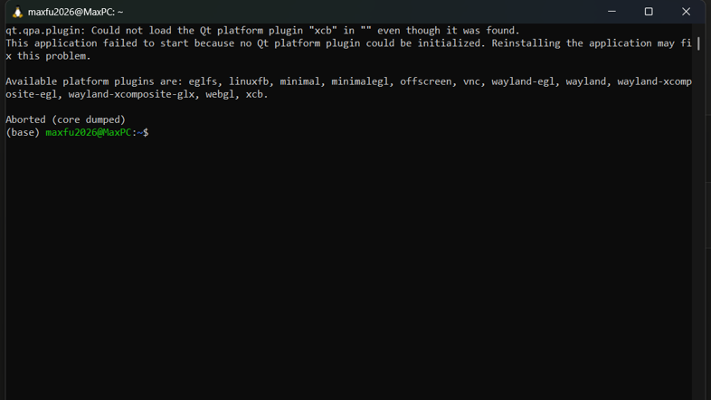

This is the classic Qt **`xcb`** plugin error on WSL/Linux. The `xcb` plugin *is* found, but it can't initialize because a runtime library it depends on is missing (most often `libxcb-cursor0`, which became a hard requirement in Qt 6).

If you're on WSL2 on Windows 11 (WSLg handles the GUI), here's how to fix it:

**Step 1 — Install the missing xcb dependencies:**

```bash
sudo apt update
sudo apt install -y libxcb-cursor0 libxcb-xinerama0 libxcb-icccm4 \
  libxcb-image0 libxcb-keysyms1 libxcb-randr0 libxcb-render-util0 \
  libxcb-shape0 libxkbcommon-x11-0
```

In ~90% of cases, just `libxcb-cursor0` alone fixes it. Try `labelme` again after this.

**Step 2 — If it still fails, get a real error message:**

```bash
QT_DEBUG_PLUGINS=1 labelme
```

This will dump the exact `.so` file it failed to load. Look for a line like `Cannot load library ... cannot open shared object file` — that tells you precisely which library is missing.

Once the fix is applied, `labelme` should launch into the GUI:

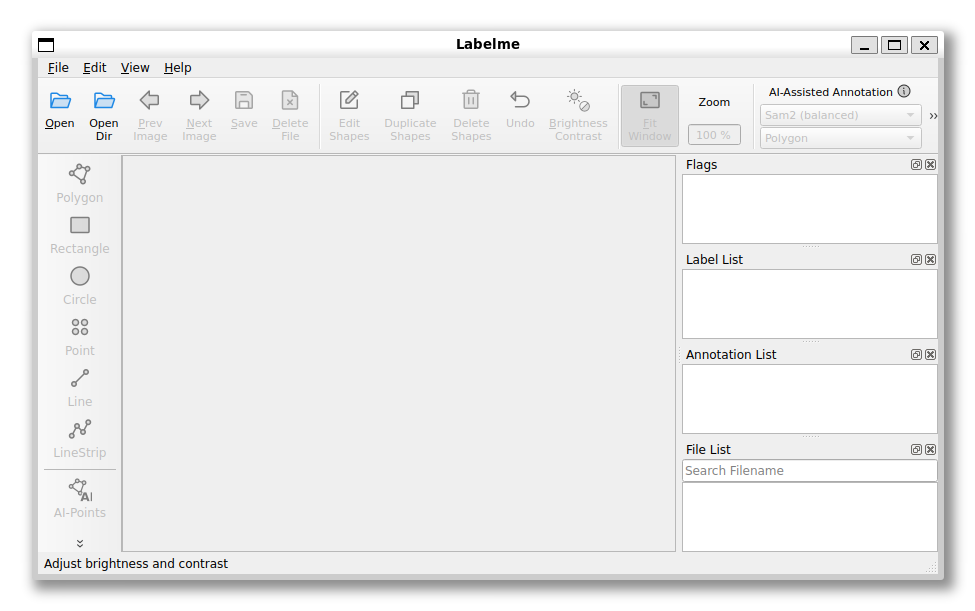

### Step D. Label your images

In the LabelMe window, click **Open Dir** and select the `mos2/` folder so every image is loaded into the file list on the right.

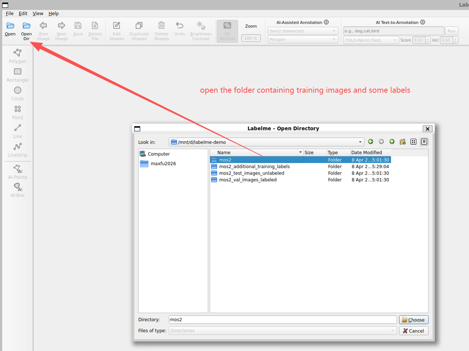

Images that already have a `.json` next to them show up with a check mark — clicking one re-loads the existing polygons so you can review or extend them.

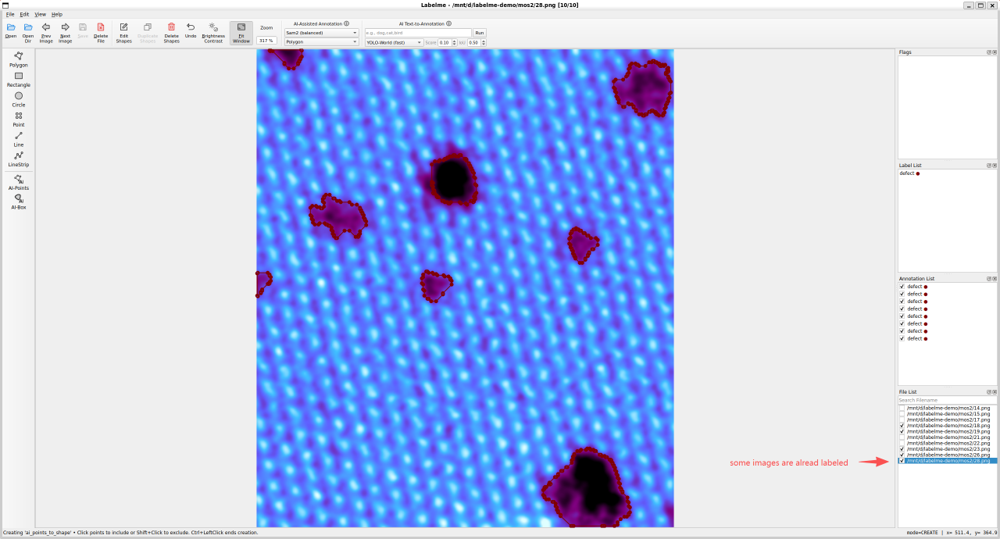

For new defects, the fastest workflow is the built-in **AI Polygon** tool, which calls Segment Anything Model 2 (`sam2`) under the hood — click inside a void and SAM2 proposes a polygon you can accept or refine.

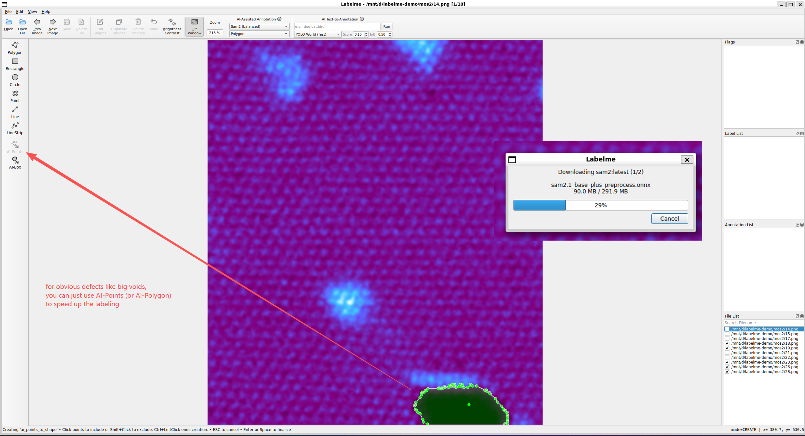

When the label-name dialog appears, **always use the same label name** (`defect`) so every void in every image maps to the same class. The training pipeline only recognises labels listed in `LABEL_MAP`.

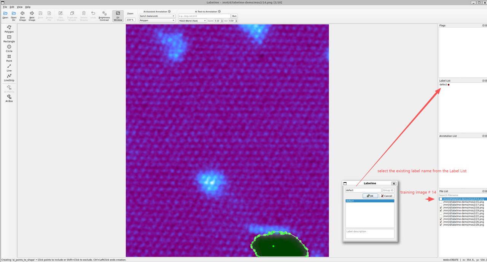

Click **Save** (or `Ctrl+S`) after each image — LabelMe writes a `.json` file next to the `.png` with the polygon coordinates.

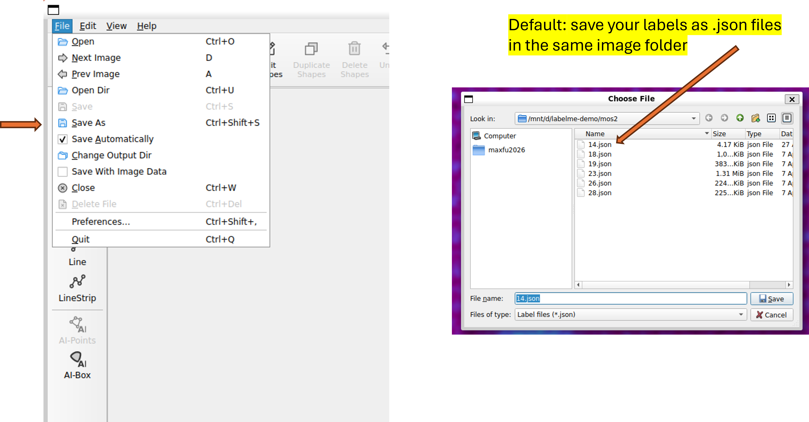

### Step E. Re-package labels and upload to Colab

After you've added or updated labels locally, re-zip the dataset folders into a new `image_data.zip` and replace the old one in your Colab session (drag-and-drop into `/content/`, or right-click → **Replace**). Then re-run **Setup of Google Colab → Step B (unzip)** so Colab picks up your fresh `.json` files before Part 1.

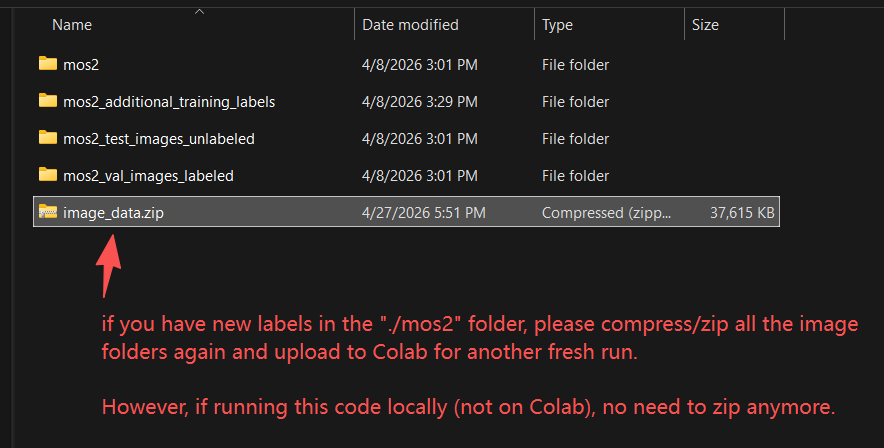

---

## Local Setup (if running on your own computer)

If you'd rather skip Colab and run the tutorial on your own machine — for example because you have a Nvidia GPU, an Apple Silicon Mac (MPS), or just want to learn the local workflow — follow the steps below.

**If you rather run this on Google Colab or doesn't have a GPU on your own machine, please skip this part and directly go to section "**Setup of Google Colab**" 

Local Setup Begins:
**You will create a new notebook from scratch in VS Code and copy each cell from this tutorial README.md as you go**, rather than downloading a finished `.ipynb`. This is intentional: typing the cells yourself is the fastest way to actually learn what each step does.

> **GPU note** — training is *much* faster on a GPU. CUDA (Nvidia) and MPS (Apple Silicon) are both supported; CPU works but a single epoch can take 10–30× longer. If you don't have a GPU, prefer Colab.

> **Windows + Nvidia GPU** — open a terminal and run `nvidia-smi` to check your installed CUDA version (shown in the top-right of the table). Match the PyTorch wheel in **Step B** to that version (e.g. CUDA 12.6 → `whl/cu126`, CUDA 12.8 → `whl/cu128`). It is **often fine if your system CUDA is newer than the PyTorch CUDA build** — Nvidia drivers are backward-compatible, so a system showing CUDA 12.8 will happily run a `cu126` PyTorch wheel. Just don't go the other way (don't install a newer PyTorch CUDA than your driver supports).

### Step A. Install Miniconda and create a new environment

Install **Miniconda** from [docs.anaconda.com/miniconda](https://docs.anaconda.com/miniconda/) (pick the installer that matches your OS). After install, open a fresh terminal — **Anaconda Prompt** on Windows, or any terminal on macOS/Linux — and create a dedicated environment for this tutorial:

```bash
conda create -n pytorch1 python=3.13 -y
conda activate pytorch1
```

Keeping this work in its own environment avoids version conflicts with anything else you have installed.

If you have a windows computer with a Nvidia GPU, type  `nvidia-smi` in the terminal to show the existing CUDA version. You might have to debug a bit if you could not find the GPU.

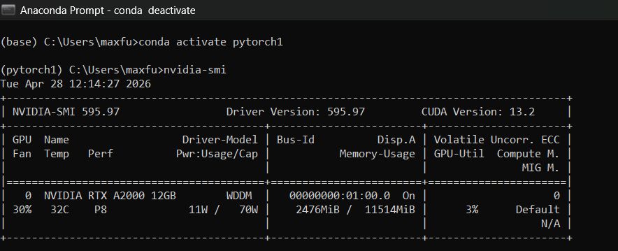

### Step B. Install PyTorch and dependencies

PyTorch is now distributed primarily via **pip wheels** (the official install guide no longer lists conda commands), so we install PyTorch with `pip` *inside* the conda env. Use the selector at [pytorch.org/get-started/locally](https://pytorch.org/get-started/locally/) to generate the exact command for your OS / CUDA combination. Examples below use CUDA 12.8.

**Nvidia GPU (CUDA 12.8):**

```bash
pip3 install torch torchvision torchaudio --index-url https://download.pytorch.org/whl/cu128
```

**Apple Silicon (MPS) or CPU-only:**

```bash
pip3 install torch torchvision torchaudio
```

Then install the remaining packages used by the notebook (please try to debug using AI tools if missing other python packages):

```bash
pip3 install numpy pillow matplotlib scikit-learn tqdm jupyter ipykernel -y
```

For reference, here is the PyTorch install selector showing the CUDA 12.8 option used above:

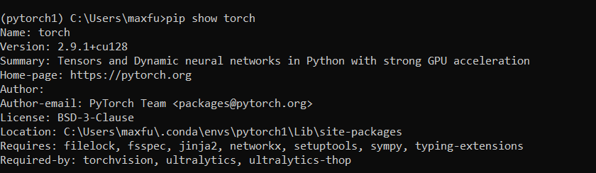

### Step C. Create a new notebook in VS Code and follow the tutorial

1. Make a new working folder (e.g. `mse544-unet/`) and place the unzipped dataset folders (`mos2/`, `mos2_val_images_labeled/`, `mos2_test_images_unlabeled/`, `mos2_additional_training_labels/`) inside it.
2. Open that folder in VS Code (`File → Open Folder…`).
3. Create a new notebook: `File → New File…` → name it `UNet-<yourUWNetID>.ipynb`.
4. Click the **kernel picker** in the top-right of the notebook and select **`(pytorch1)`** — the conda env you made in Step A.
5. Walk through this **README** from the top: for each numbered step in **Part 1 / Part 2 / Part 3**, add a markdown cell with the section heading + description, then a code cell with the python from the matching block, and run it. The code is identical to Colab; just skip the two `/content/` cells in **Setup of Google Colab → Step A & Step B** because your dataset is already in the working folder.
6. **Setup of Google Colab→ Step C (PyTorch + GPU check)** should now print your own GPU (e.g. `RTX 4070`) on CUDA, `mps` on Apple Silicon, or fall back to `cpu`.

Everything else — Part 1 dataset prep, Part 2 training, Part 3 inference — runs identically.

---

## Setup of Google Colab

Before you start, open [Google Colab](https://colab.research.google.com/) and create a new Jupyter notebook via `File → New notebook`.

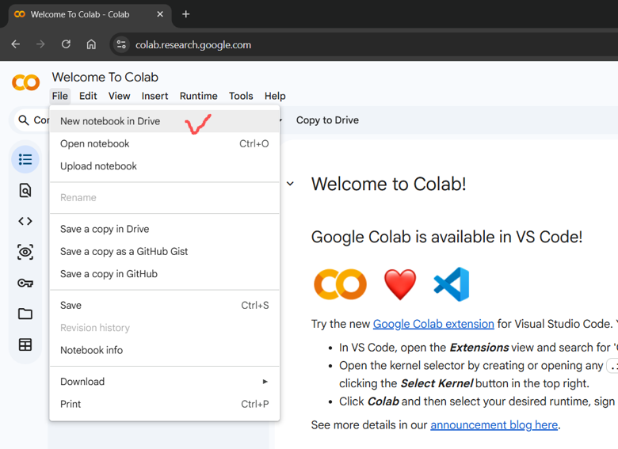

Rename the notebook to something descriptive (e.g. `U-Net-yourUWNetID.ipynb`) by clicking the title at the top of the page.

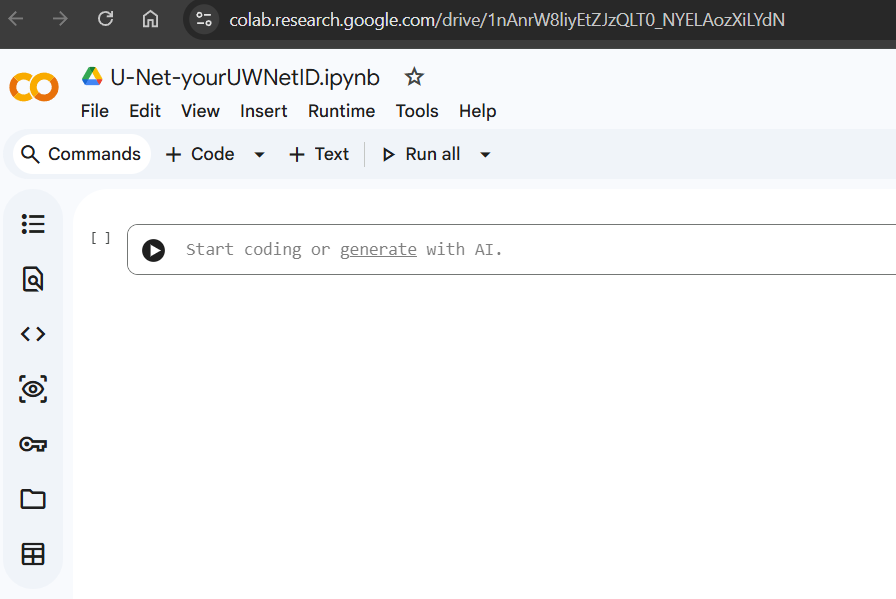

Switch the runtime to a free Nvidia T4 GPU via `Runtime → Change runtime type → T4 GPU`, then click **Save**.


Upload `image_data.zip` to the Colab session by opening the **Files** tab in the left sidebar and dragging the zip into `/content/` (or use the **Upload** button).

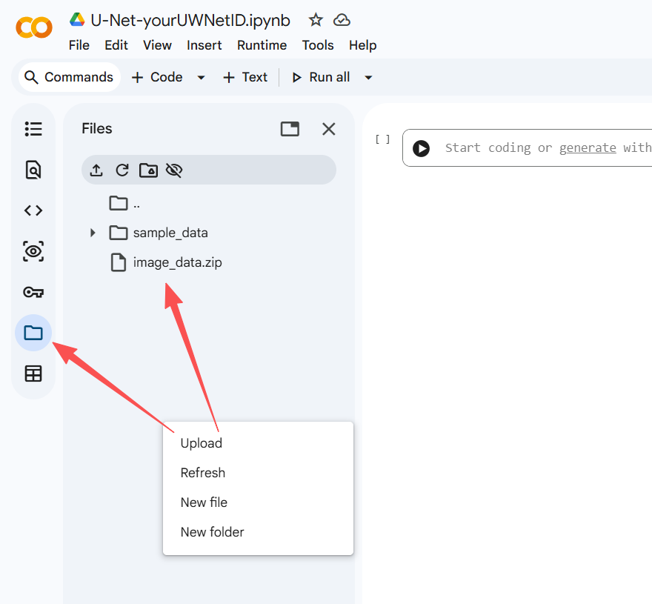

Then run the three setup cells below to clean up any previous outputs, unzip the image dataset, and confirm that PyTorch can see your GPU. You will only need to run Step A and Step B once per session — Step C is worth re-running any time you reconnect to a Colab runtime to make sure a GPU is still attached.

### Step A. Optional cleanup (skip on first run)

Open your notebook and run the cell below to wipe any previous `mos2*` outputs under `/content/`. Leave it commented unless you really want a fresh start — on a local machine this would delete files permanently.

```python
#!rm -rf /content/mos2*  

## This command can be used to clean up previous runs when needed.
## Be careful with this command when running on your local machine! It will delete files permanently.
```

### Step B. Optional unzip (run once)

Run this cell to extract the bundled `image_data.zip` into `/content/` so the dataset folders (`mos2`, `mos2_val_images_labeled`, `mos2_test_images_unlabeled`, …) appear at the expected paths. **Uncomment the line on the very first run, then comment it back out for subsequent runs of the entire notebook.** You may find this useful when you are trying to fine tune your models later on.

```python
#!unzip image_data.zip -d /content/  

## enable this command only for the first time to unzip the data.
```

After the cell finishes, the dataset folders should show up in the **Files** sidebar:

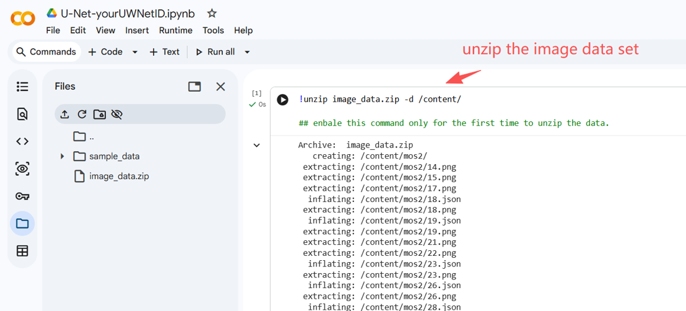

### Step C. Check PyTorch and GPU

Run this cell to confirm that PyTorch is installed and that an Nvidia GPU is attached. The output should print your PyTorch version, `Is CUDA available: True`, and the GPU device name (e.g. `Tesla T4`). If you see `Is CUDA available: False`, go back to **Runtime → Change runtime type → T4 GPU** in Colab and reconnect before continuing.

```python
# Check PyTorch installation and GPU availability on Google Colab

import torch
print(f"PyTorch version: {torch.__version__}")
print(f"Is CUDA available: {torch.cuda.is_available()}")
if torch.cuda.is_available():
    print(f"GPU Device: {torch.cuda.get_device_name(0)}")
```

Expected output — PyTorch detects CUDA and reports the Tesla T4:

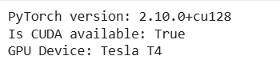

---

# Part 1 — Dataset Preparation

In Part 1, you will turn the raw MoS₂ images and their LabelMe polygon annotations into the binary integer masks (`background = 0`, `defect = 1`) that the U-Net will train on. You will also crop each original image into 256 × 256 patches, apply augmentation to the training patches only, and write the final dataset out to `mos2_dataset/`. By the end of this part, you should have a clean train/val split with sanity-checked masks and a clear sense of how imbalanced the defect class is.

### Step A. Settings

Central configuration for the dataset-prep stage: input/output folder paths, the patch size (`PATCH=256`), whether to drop empty patches, and the `label → class index` map. **Change `PATCH` here if you want to experiment with different patch sizes** (e.g. 128 or 384) — the rest of Part 1 will follow.

```python
import os, json, shutil
import numpy as np
from PIL import Image, ImageDraw
from sklearn.model_selection import train_test_split

# ============================================================
# Settings
# ============================================================
DATA_DIR     = './mos2'                     # training images + labels
VAL_DIR      = './mos2_val_images_labeled'   # validation images + labels
TEST_DIR     = './mos2_test_images_unlabeled' # unlabeled test images
OUT_DIR      = './mos2_dataset'              # output root

PATCH        = 256                # smaller patches for the next U-Net ablation
REMOVE_EMPTY = True               # skip patches with no annotations
RANDOM_SEED  = 42

# Label → class index mapping (background = 0)
LABEL_MAP = {
    'defect': 1,
}
NUM_CLASSES = 2   # background + defect


print('Settings OK')
print(f'  PATCH={PATCH}, REMOVE_EMPTY={REMOVE_EMPTY}')
print(f'  NUM_CLASSES={NUM_CLASSES} (including background)')
```

### Step B. Output folder structure

Recreates a clean `mos2_dataset/` tree with `images/{train,val}` and `masks/{train,val}` subfolders. Any previous output is removed so each run starts from a known-empty state.

```python
# ============================================================
# Output folder structure
# ============================================================
if os.path.exists(OUT_DIR):
    shutil.rmtree(OUT_DIR)

paths = {}
for split in ['train', 'val']:
    for sub in ['images', 'masks']:
        p = os.path.join(OUT_DIR, sub, split)
        os.makedirs(p, exist_ok=True)
        paths[f'{sub}_{split}'] = p

print('Output folders created:')
for k, v in paths.items():
    print(f'  {v}')
```

Expected output — the four `images/{train,val}` and `masks/{train,val}` folders are printed:

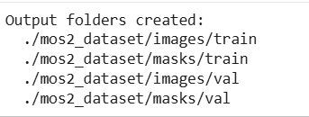

### Step C. Mask helper from LabelMe JSON

Defines `load_multiclass_mask`, which rasterises the polygon shapes from a LabelMe `.json` into an integer mask array (0 = background, 1 = defect) the same size as the original image. This is how `.json` annotations become `.png` masks the network can train on.

```python
# ============================================================
# Helpers: mask from LabelMe JSON
# ============================================================

def load_multiclass_mask(json_path, image_size):
    """Returns an (H, W) uint8 array: 0=background, 1=defect."""
    with open(json_path) as f:
        data = json.load(f)

    w, h = image_size
    mask = Image.new('L', (w, h), 0)
    draw = ImageDraw.Draw(mask)

    for s in data['shapes']:
        label = s['label']
        if label not in LABEL_MAP or s['shape_type'] != 'polygon':
            continue
        pts = [tuple(p) for p in s['points']]
        draw.polygon(pts, fill=LABEL_MAP[label])

    return np.array(mask, dtype=np.uint8)


print('Helpers defined.')
```

### Step D. Augmentation helpers

Declares the augmentation tag list (`AUG_TAGS`) and a single `augment_array` function that applies the same flip/rotation to image and mask in lock-step. **Full augmentation uses all 6 transforms** — `orig`, `fliplr`, `flipud`, `rot90`, `rot180`, `rot270` — which multiplies the training set 6× and is one of the easiest places to lift defect IoU (see Q3). For a faster baseline run, drop back to `['orig', 'fliplr']`.

```python
# ============================================================
# Augmentation helpers
# ============================================================

# Full augmentation: 6 transforms (original + horizontal/vertical flip + 3 rotations)
AUG_TAGS = ['orig', 'fliplr', 'flipud', 'rot90', 'rot180', 'rot270']

def augment_array(arr, tag):
    if tag == 'fliplr':  return np.fliplr(arr)
    #if tag == 'flipud':  return np.flipud(arr)
    #if tag == 'rot90':   return np.rot90(arr, 1)
    #if tag == 'rot180':  return np.rot90(arr, 2)
    #if tag == 'rot270':  return np.rot90(arr, 3)
    return arr  # 'orig'


print('Augmentation helpers defined.')
```

### Step E. Collect image/json pairs

Scans the `mos2/` and `mos2_val_images_labeled/` folders and lists every image stem that has a matching `.json` label file. Useful as a quick sanity check that your labeling work has actually landed in the right folder.

```python
# ============================================================
# Collect image/json pairs
# ============================================================
def collect_pairs(directory):
    pairs = []
    for f in os.listdir(directory):
        if f.endswith('.json'):
            stem = f.replace('.json', '')
            img_path = os.path.join(directory, stem + '.png')
            if os.path.exists(img_path):
                pairs.append(stem)
    pairs.sort(key=lambda x: int(x) if x.isdigit() else x)
    return pairs

train_pairs = collect_pairs(DATA_DIR)
val_pairs   = collect_pairs(VAL_DIR)

print(f'Train labeled images ({len(train_pairs)}): {train_pairs}')
print(f'Val labeled images   ({len(val_pairs)}): {val_pairs}')
```

Expected output — the labeled training and validation image IDs found in each folder:

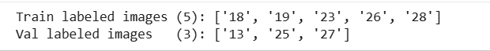

### Step F. Train / val split

Locks in the train/val split — the validation IDs come from a fixed folder so that everyone in the class is judged on the **same 3 validation images**. This is what makes the `val_target_iou` metric comparable across submissions.

```python
# ============================================================
# Train / val split (pre-defined by folder structure)
# ============================================================
train_ids = train_pairs
val_ids   = val_pairs

print(f'Train: {len(train_ids)} images')
print(f'Val:   {len(val_ids)} images')
print(f'Val IDs: {sorted(val_ids)}')
```

Expected output — the locked-in train/val split with the fixed validation IDs:

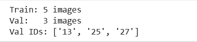

### Step G. Patch extraction + dataset generation

The main preprocessing routine. For every labeled image it (a) tiles into non-overlapping `PATCH × PATCH` patches, (b) drops empty patches when `REMOVE_EMPTY=True`, (c) applies augmentation tags **to training patches only**, and (d) writes the image and integer mask side-by-side into `mos2_dataset/`. Validation patches are **never** augmented so the eval metric stays honest.

```python
# ============================================================
# Patch extraction + dataset generation
# ============================================================

def process_split(ids, img_dir, mask_dir, src_dir=None, augment=False):
    if src_dir is None:
        src_dir = DATA_DIR
    count = 0
    skipped_empty = 0

    for stem in ids:
        img_pil  = Image.open(os.path.join(src_dir, stem + '.png')).convert('L')
        img_np   = np.array(img_pil)
        h, w     = img_np.shape

        mask_np  = load_multiclass_mask(
            os.path.join(src_dir, stem + '.json'),
            img_pil.size  # (w, h)
        )

        # Tile into PATCH x PATCH patches
        patch_coords = [
            (x, y)
            for y in range(0, h - PATCH + 1, PATCH)
            for x in range(0, w - PATCH + 1, PATCH)
        ]

        # If image is smaller than PATCH in any dim, use (0,0) as single patch
        if not patch_coords:
            patch_coords = [(0, 0)]

        for (px, py) in patch_coords:
            # Crop (or take full image if smaller than PATCH)
            x2 = min(px + PATCH, w)
            y2 = min(py + PATCH, h)
            img_patch  = img_np[py:y2, px:x2]
            mask_patch = mask_np[py:y2, px:x2]

            # Pad to PATCH x PATCH if needed
            ph, pw = img_patch.shape
            if ph < PATCH or pw < PATCH:
                img_pad  = np.zeros((PATCH, PATCH), dtype=img_patch.dtype)
                mask_pad = np.zeros((PATCH, PATCH), dtype=mask_patch.dtype)
                img_pad[:ph, :pw]  = img_patch
                mask_pad[:ph, :pw] = mask_patch
                img_patch, mask_patch = img_pad, mask_pad

            if REMOVE_EMPTY and mask_patch.sum() == 0:
                skipped_empty += 1
                continue


            tags = AUG_TAGS if augment else ['orig']

            for tag in tags:
                img_aug  = augment_array(img_patch, tag)
                mask_aug = augment_array(mask_patch, tag)
                name = f'{stem}_x{px}_y{py}_{tag}'

                # Save image patch (grayscale)
                Image.fromarray(img_aug).save(
                    os.path.join(img_dir, name + '.png')
                )

                # Save binary mask (integer values 0-1)
                Image.fromarray(mask_aug).save(
                    os.path.join(mask_dir, name + '.png')
                )

                count += 1

    return count, skipped_empty


n_train, skip_train = process_split(
    train_ids,
    paths['images_train'], paths['masks_train'],
    augment=True
)

n_val, skip_val = process_split(
    val_ids,
    paths['images_val'], paths['masks_val'],
    src_dir=VAL_DIR,
    augment=False
)

print('\n Dataset generation complete:')
print(f'  Train patches: {n_train}  (skipped {skip_train} empty)')
print(f'  Val patches:   {n_val}    (skipped {skip_val} empty)')
```

Expected output — train and val patch counts plus the number of empty patches skipped:

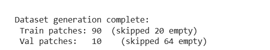

### Step H. Sanity-check visualisation

Loads the first training patch that contains a defect and overlays its mask in **yellow** on the grayscale image. If the yellow blob doesn't visually align with the dark void in the patch, your label-to-mask conversion is broken — fix it before training.

```python
# ============================================================
# Quick sanity-check visualisation
# ============================================================
import matplotlib.pyplot as plt
import matplotlib.colors as mcolors

CLASS_COLORS = {
    0: 'black',      # background
    1: 'yellow',     # defect
}

# Pick the first train patch that has annotations
train_imgs  = sorted(os.listdir(paths['images_train']))
train_masks = sorted(os.listdir(paths['masks_train']))

for fname in train_imgs[:10]:
    img  = np.array(Image.open(os.path.join(paths['images_train'], fname)))
    mask = np.array(Image.open(os.path.join(paths['masks_train'], fname)))
    if mask.max() > 0:
        break

fig, axes = plt.subplots(1, 2, figsize=(10, 5))

axes[0].imshow(img, cmap='gray')
axes[0].set_title(fname)
axes[0].axis('off')

# Colour-coded mask overlay
rgba = np.zeros((*mask.shape, 4), dtype=np.float32)
for cls_id, color in CLASS_COLORS.items():
    if cls_id == 0:
        continue
    rgb = mcolors.to_rgb(color)
    rgba[mask == cls_id, :3] = rgb
    rgba[mask == cls_id, 3]  = 0.6

axes[1].imshow(img, cmap='gray')
axes[1].imshow(rgba)
axes[1].set_title('Mask overlay (yellow=defect)')
axes[1].axis('off')

plt.tight_layout()
plt.show()
```

Expected output — a training patch alongside its yellow defect-mask overlay:

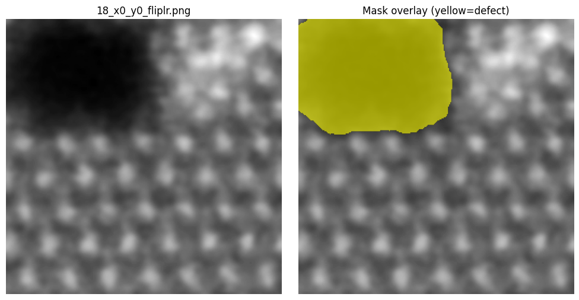

### Step I. Class balance stats

Counts pixels per class across the training set and prints the percentages. You should see **background ≫ defect** (often >95% vs <5%); that imbalance directly motivates the class weighting and weighted sampler used later (Q4).

```python
# ============================================================
# Class balance stats
# ============================================================
from collections import Counter

class_names = {0: 'background', 1: 'defect'}
pixel_counts = Counter()

for fname in os.listdir(paths['masks_train']):
    m = np.array(Image.open(os.path.join(paths['masks_train'], fname)))
    for cls in range(NUM_CLASSES):
        pixel_counts[cls] += int((m == cls).sum())

total = sum(pixel_counts.values())
print('Train pixel class distribution:')
for cls in range(NUM_CLASSES):
    pct = 100 * pixel_counts[cls] / total
    print(f'  Class {cls} ({class_names[cls]}): {pixel_counts[cls]:>12,} px  ({pct:.3f}%)')
```

Expected output — the train pixel distribution showing background ≫ defect (the imbalance that motivates class weighting and weighted sampling later):

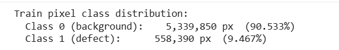

---

# Part 2 — U-Net Training (Binary Defect Segmentation)

In Part 2, you will define the U-Net architecture, configure the loss and optimiser, and train the network on the patches you generated in Part 1. The model has two output classes (`background`, `defect`); the loss is **Focal Cross-Entropy** with an optional **focal Tversky** term, and the best checkpoint is selected by **defect IoU** on the fixed validation set. By the end of this part, you should have a saved `unet_best.pt` checkpoint, a training-history plot, and side-by-side validation visualisations to compare your predictions against the ground-truth masks.

### Step A. Print labeled MoS2 image IDs

Prints the IDs of every image in `./mos2/` that has a paired `.json` annotation. Use this list to confirm which raw images are actually contributing to training, and which still need labeling (or could be brought in from `mos2_additional_training_labels`).

```python
# Print which source images have LabelMe JSON annotations
# mos2/ contains training labeled images; mos2_val_images_labeled/ contains val labeled images
MOS2_DIR = './mos2'
IMAGE_EXTENSIONS = ('.png', '.jpg', '.jpeg', '.tif', '.tiff', '.bmp')

def _sort_key(name):
    stem = os.path.splitext(name)[0]
    return (0, int(stem)) if stem.isdigit() else (1, stem)

json_files = sorted(
    [name for name in os.listdir(MOS2_DIR) if name.lower().endswith('.json')],
    key=_sort_key,
)

labeled_images = []
missing_images = []
for json_name in json_files:
    stem = os.path.splitext(json_name)[0]
    image_name = next(
        (stem + ext for ext in IMAGE_EXTENSIONS
         if os.path.exists(os.path.join(MOS2_DIR, stem + ext))),
        None,
    )
    if image_name is None:
        missing_images.append(json_name)
    else:
        labeled_images.append(image_name)

labeled_ids = [os.path.splitext(name)[0] for name in json_files]
print(f'Labeled image IDs ({len(labeled_ids)}):')
print(labeled_ids)
#print(f'Images with labels ({len(labeled_images)}):')
#print(labeled_images)
if missing_images:
    print(f'JSON files without matching image: {missing_images}')
```

Expected output — the list of labeled image IDs found under `./mos2/`:

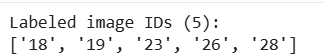

### Step B. (Optional) Install dependencies

Optional `pip install` line for environments where PyTorch isn't already available. Colab comes with these pre-installed, so you can usually leave this commented out.

This will be very useful if you want to run the code locally on your own computer with your own python environment.

```python
#!pip install torch torchvision tqdm scikit-learn
```

### Step C. MoS2 Dataset (`Dataset` + `DataLoader`)

Custom PyTorch `Dataset` that loads each grayscale patch + integer mask, remaps any legacy mask values down to `{0, 1}`, and pre-computes a per-sample weight. Patches that contain a defect get a `+3.0` weight so the `WeightedRandomSampler` later draws them more often — a key trick to fight class imbalance at the **batch** level (not just the loss level).

```python
import os
import torch
import numpy as np
from PIL import Image
from torch.utils.data import Dataset, DataLoader, WeightedRandomSampler
import torchvision.transforms as T

NUM_CLASSES = 2   # background(0) + defect(1)
CLASS_NAMES = ['background', 'defect']
TARGET_CLASS_IDS = (1,)

# Collapse any legacy L1 masks into the binary encoding: 0=background, 1=defect.
_REMAP = np.array([0, 1, 1, 1], dtype=np.int64)

_SAMPLE_BONUS = {1: 3.0}

class MoS2Dataset(Dataset):
    def __init__(self, img_dir, mask_dir):
        self.img_dir = img_dir
        self.mask_dir = mask_dir
        self.files = sorted(os.listdir(img_dir))
        self.img_tf = T.ToTensor()
        self.sample_weights = self._build_sample_weights()

    def _load_mask_array(self, name):
        mask = Image.open(os.path.join(self.mask_dir, name)).convert('L')
        return _REMAP[np.array(mask)]

    def _build_sample_weights(self):
        weights = []
        for name in self.files:
            classes = set(np.unique(self._load_mask_array(name)).tolist())
            classes.discard(0)
            bonus = max((_SAMPLE_BONUS.get(int(cls), 0.0) for cls in classes), default=0.0)
            weights.append(1.0 + bonus)
        return torch.tensor(weights, dtype=torch.double)

    def __len__(self):
        return len(self.files)

    def __getitem__(self, idx):
        name = self.files[idx]

        img = Image.open(os.path.join(self.img_dir, name)).convert('L')
        mask = torch.from_numpy(self._load_mask_array(name)).long()
        img = self.img_tf(img)

        return img, mask, name
```

### Step D. Create the U-Net model

Defines the U-Net architecture: a `DoubleConv` block (Conv → GroupNorm → ReLU, twice, with optional dropout), a 4-level encoder/decoder with channel widths `32 → 64 → 128 → 256 → 512`, and **skip connections** that concatenate matching encoder features into each decoder block. The final `1×1` conv emits per-class logits at full resolution. See Q5 for why skip connections are crucial for pixel-wise tasks.

```python
import torch.nn as nn

def make_group_norm(num_channels, max_groups=8):
    groups = min(max_groups, num_channels)
    while num_channels % groups != 0:
        groups -= 1
    return nn.GroupNorm(groups, num_channels)

class DoubleConv(nn.Module):
    def __init__(self, in_c, out_c, dropout=0.0):
        super().__init__()
        layers = [
            nn.Conv2d(in_c, out_c, 3, padding=1, bias=False),
            make_group_norm(out_c),
            nn.ReLU(inplace=True),
            nn.Conv2d(out_c, out_c, 3, padding=1, bias=False),
            make_group_norm(out_c),
            nn.ReLU(inplace=True),
        ]
        if dropout > 0:
            layers.append(nn.Dropout2d(dropout))
        self.net = nn.Sequential(*layers)

    def forward(self, x):
        return self.net(x)


class UNet(nn.Module):
    def __init__(self, num_classes):
        super().__init__()
        self.pool = nn.MaxPool2d(2)

        self.d1 = DoubleConv(1, 32)
        self.d2 = DoubleConv(32, 64)
        self.d3 = DoubleConv(64, 128)
        self.d4 = DoubleConv(128, 256, dropout=0.10)
        self.bottleneck = DoubleConv(256, 512, dropout=0.25)

        self.u4 = nn.ConvTranspose2d(512, 256, 2, stride=2)
        self.uconv4 = DoubleConv(512, 256, dropout=0.10)
        self.u3 = nn.ConvTranspose2d(256, 128, 2, stride=2)
        self.uconv3 = DoubleConv(256, 128)
        self.u2 = nn.ConvTranspose2d(128, 64, 2, stride=2)
        self.uconv2 = DoubleConv(128, 64)
        self.u1 = nn.ConvTranspose2d(64, 32, 2, stride=2)
        self.uconv1 = DoubleConv(64, 32)

        self.out = nn.Conv2d(32, num_classes, 1)

    def forward(self, x):
        c1 = self.d1(x)
        c2 = self.d2(self.pool(c1))
        c3 = self.d3(self.pool(c2))
        c4 = self.d4(self.pool(c3))
        bn = self.bottleneck(self.pool(c4))

        x = self.uconv4(torch.cat([self.u4(bn), c4], dim=1))
        x = self.uconv3(torch.cat([self.u3(x), c3], dim=1))
        x = self.uconv2(torch.cat([self.u2(x), c2], dim=1))
        x = self.uconv1(torch.cat([self.u1(x), c1], dim=1))

        return self.out(x)   # (B, num_classes, H, W) logits
```

### Step E. Class weights and loss (Focal CE + optional focal Tversky)

Computes inverse-frequency class weights from the training masks (boosting the rare `defect` class) and defines two losses: **focal cross-entropy** (the active baseline) and **focal Tversky** (commented out). The `total_loss` wrapper currently returns CE only — uncomment the combined `CE + 0.45 * Tversky` line to better penalise false negatives, which is one of the recommended improvements for Q6/Q8.

```python
import torch.nn as nn
import torch.nn.functional as F

CLASS_WEIGHT_MULTIPLIERS = torch.tensor([1.0, 3.0], dtype=torch.float32)

def compute_class_weights(mask_dir, num_classes, max_weight=24.0, power=0.35):
    pixel_counts = torch.zeros(num_classes, dtype=torch.float64)

    for name in sorted(os.listdir(mask_dir)):
        mask = Image.open(os.path.join(mask_dir, name)).convert('L')
        mask = _REMAP[np.array(mask)]
        values, counts = np.unique(mask, return_counts=True)
        for value, count in zip(values, counts):
            pixel_counts[int(value)] += int(count)

    freqs = pixel_counts / pixel_counts.sum().clamp_min(1)
    weights = (freqs.max() / freqs.clamp_min(1e-12)) ** power
    weights = weights / weights[0]
    weights = weights.float() * CLASS_WEIGHT_MULTIPLIERS
    weights = weights / weights[0]
    weights = torch.clamp(weights, max=max_weight)
    return weights.float(), pixel_counts.long()

CLASS_WEIGHTS, PIXEL_COUNTS = compute_class_weights('mos2_dataset/masks/train', NUM_CLASSES)

def focal_ce_loss(logits, targets, class_weights, gamma=1.5, label_smoothing=0.02):
    ce = F.cross_entropy(
        logits,
        targets,
        reduction='none',
        weight=class_weights.to(logits.device),
        label_smoothing=label_smoothing,
    )
    pt = torch.exp(-ce)
    return (((1 - pt) ** gamma) * ce).mean()

def focal_tversky_loss(logits, targets, class_weights, alpha=0.7, beta=0.3, gamma=1.33, smooth=1e-6):
    probs = F.softmax(logits, dim=1)
    losses = []
    weights = []

    target_weights = class_weights[list(TARGET_CLASS_IDS)].to(logits.device)
    target_weights = target_weights / target_weights.sum()

    for class_idx, class_weight in zip(TARGET_CLASS_IDS, target_weights):
        pred = probs[:, class_idx]
        truth = (targets == class_idx).float()
        if truth.sum() == 0:
            continue
        tp = (pred * truth).sum()
        fp = (pred * (1 - truth)).sum()
        fn = ((1 - pred) * truth).sum()
        tversky = (tp + smooth) / (tp + alpha * fp + beta * fn + smooth)
        losses.append((1 - tversky) ** gamma)
        weights.append(class_weight)

    if not losses:
        return logits.sum() * 0.0

    losses = torch.stack(losses)
    weights = torch.stack(weights)
    return (losses * weights).sum() / weights.sum()

def total_loss(logits, targets, class_weights):
    # Baseline: Focal Cross-Entropy only (Tversky term removed)
    # TODO: restore combined loss:
    # return focal_ce_loss(logits, targets, class_weights) + 0.45 * focal_tversky_loss(logits, targets, class_weights)
    return focal_ce_loss(logits, targets, class_weights)

print(f'NUM_CLASSES = {NUM_CLASSES}')
print('Train pixel counts:')
for c, name in enumerate(CLASS_NAMES):
    print(f'  {c} {name:<12} {PIXEL_COUNTS[c].item():>12,} px')
print('\nFocused class weights (boosting defect):')
for c, name in enumerate(CLASS_NAMES):
    print(f'  {c} {name:<12} {CLASS_WEIGHTS[c].item():.2f}')
```

Expected output — train pixel counts and the inverse-frequency class weights (defect weight ≫ 1.0 to boost the rare class):

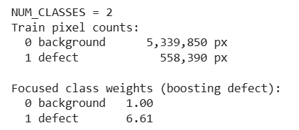

### Step F. Pick device

Picks the best available compute device in priority order: Apple **MPS** → Nvidia **CUDA** → **CPU**. On Colab with a T4 selected this should print `cuda`.

```python
if torch.backends.mps.is_available():
    device = torch.device('mps')
elif torch.cuda.is_available():
    device = torch.device('cuda')
else:
    device = torch.device('cpu')

print('Using device:', device)
```

Expected output — `Using device: cuda` on a Colab T4 runtime:

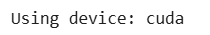

### Step G. Training loop

The main training cell. Sets the hyperparameters (`BATCH_SIZE`, `EPOCHS=10` baseline, `LR=1e-4`, `WEIGHT_DECAY=3e-4`), builds a **weighted-sampler DataLoader** for training, and runs an epoch loop with AdamW, gradient clipping, and `ReduceLROnPlateau`. Each epoch tracks train/val loss and defect IoU; the **best-IoU checkpoint** is saved to `unet_best.pt`, with early stopping after 3 stagnant epochs. **Bumping `EPOCHS` to 20–30** is the simplest knob for Q7.

```python
from tqdm import tqdm

BATCH_SIZE = 2 
EPOCHS = 1   # you may try 10, 20, 30 epochs for a better trained model
LR = 1e-4
WEIGHT_DECAY = 3e-4
EARLY_STOPPING_PATIENCE = 3
CLASS_CONFIDENCE_THRESHOLDS = {1: 0.50}

print(f'batch_size={BATCH_SIZE}, epochs={EPOCHS}, lr={LR}, weight_decay={WEIGHT_DECAY}')
print(f'class confidence thresholds: {CLASS_CONFIDENCE_THRESHOLDS}')

train_ds = MoS2Dataset('mos2_dataset/images/train', 'mos2_dataset/masks/train')
val_ds = MoS2Dataset('mos2_dataset/images/val', 'mos2_dataset/masks/val')

train_sampler = WeightedRandomSampler(
    weights=train_ds.sample_weights,
    num_samples=len(train_ds),
    replacement=True,
)

print(f'train sample weight range: {float(train_ds.sample_weights.min()):.1f} - {float(train_ds.sample_weights.max()):.1f}')

pin_memory = device.type == 'cuda'
train_loader = DataLoader(train_ds, batch_size=BATCH_SIZE, sampler=train_sampler, num_workers=0, pin_memory=pin_memory)
val_loader = DataLoader(val_ds, batch_size=BATCH_SIZE, shuffle=False, num_workers=0, pin_memory=pin_memory)

model = UNet(num_classes=NUM_CLASSES).to(device)
opt = torch.optim.AdamW(model.parameters(), lr=LR, weight_decay=WEIGHT_DECAY)
class_weights = CLASS_WEIGHTS.to(device)
scheduler = torch.optim.lr_scheduler.ReduceLROnPlateau(opt, mode='max', factor=0.5, patience=3)

def decode_predictions(logits, class_thresholds=CLASS_CONFIDENCE_THRESHOLDS):
    probs = F.softmax(logits, dim=1)
    confidence, preds = probs.max(dim=1)
    preds = preds.clone()
    for class_idx, threshold in class_thresholds.items():
        preds[(preds == class_idx) & (confidence < threshold)] = 0
    return preds

def accumulate_iou(intersection, union, logits, targets):
    preds = decode_predictions(logits)
    for class_idx in range(NUM_CLASSES):
        pred_mask = preds == class_idx
        true_mask = targets == class_idx
        intersection[class_idx] += (pred_mask & true_mask).sum().item()
        union[class_idx] += (pred_mask | true_mask).sum().item()

def run_epoch(model, loader, class_weights, device, optimizer=None, desc='Train'):
    is_train = optimizer is not None
    model.train() if is_train else model.eval()
    total = 0.0
    intersection = torch.zeros(NUM_CLASSES, dtype=torch.float64)
    union = torch.zeros(NUM_CLASSES, dtype=torch.float64)
    iterator = tqdm(loader, desc=desc, leave=False)

    for x, y, _ in iterator:
        x = x.to(device, non_blocking=pin_memory)
        y = y.to(device, non_blocking=pin_memory)

        if is_train:
            optimizer.zero_grad()
            logits = model(x)
            loss = total_loss(logits, y, class_weights)
            loss.backward()
            torch.nn.utils.clip_grad_norm_(model.parameters(), max_norm=1.0)
            optimizer.step()
        else:
            with torch.no_grad():
                logits = model(x)
                loss = total_loss(logits, y, class_weights)

        total += loss.item()
        accumulate_iou(intersection, union, logits.detach(), y)
        iterator.set_postfix(loss=f'{loss.item():.4f}')

    iou = intersection / union.clamp_min(1.0)
    target_iou = iou[list(TARGET_CLASS_IDS)].mean().item()
    return total / len(loader), iou, target_iou

best_val_target_iou = -1.0
epochs_without_improvement = 0
history = {'train': [], 'val': [], 'lr': [], 'train_target_iou': [], 'val_target_iou': []}

for epoch in range(EPOCHS):
    train_loss, train_iou, train_target_iou = run_epoch(model, train_loader, class_weights, device, optimizer=opt, desc=f'Train {epoch + 1}/{EPOCHS}')
    val_loss, val_iou, val_target_iou = run_epoch(model, val_loader, class_weights, device, optimizer=None, desc=f'Val {epoch + 1}/{EPOCHS}')

    current_lr = opt.param_groups[0]['lr']
    history['train'].append(train_loss)
    history['val'].append(val_loss)
    history['lr'].append(current_lr)
    history['train_target_iou'].append(train_target_iou)
    history['val_target_iou'].append(val_target_iou)

    print(f'Epoch {epoch + 1:02d}  Train loss: {train_loss:.4f}  Val loss: {val_loss:.4f}  Train IoU: {train_target_iou:.4f}  Val IoU: {val_target_iou:.4f}  LR: {current_lr:.2e}')

    scheduler.step(val_target_iou)

    if val_target_iou > best_val_target_iou:
        best_val_target_iou = val_target_iou
        epochs_without_improvement = 0
        torch.save(model.state_dict(), 'unet_best.pt')
    else:
        epochs_without_improvement += 1
        if epochs_without_improvement >= EARLY_STOPPING_PATIENCE:
            print(f'Early stopping after {epoch + 1} epochs.')
            break

print(f'\nTraining complete. Best val defect IoU: {best_val_target_iou:.4f}')
print('Model saved to unet_best.pt')
```

Expected output — per-epoch train/val loss and defect IoU, ending with the best validation IoU and the saved checkpoint path:

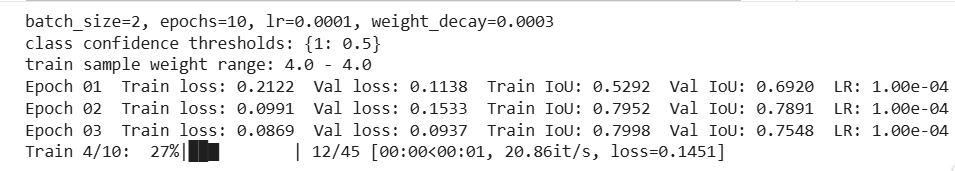

### Step H. Plot training curves (training history)

Plots three side-by-side panels — **Train vs Val loss**, **Defect IoU**, and the **LR schedule** — and marks the best epoch with a dashed vertical line. Use this to spot under-training (curves still trending), over-fitting (val curve diverging from train), or LR-schedule problems.

```python
import matplotlib.pyplot as plt

epochs_range = range(1, len(history['train']) + 1)
fig, axes = plt.subplots(1, 3, figsize=(16, 4))

# Loss curves
axes[0].plot(epochs_range, history['train'], label='Train loss', marker='o', markersize=3)
axes[0].plot(epochs_range, history['val'], label='Val loss', marker='o', markersize=3)
best_epoch = history['val_target_iou'].index(max(history['val_target_iou'])) + 1
axes[0].axvline(best_epoch, color='gray', linestyle='--', linewidth=1, label=f'Best epoch ({best_epoch})')
axes[0].set_xlabel('Epoch')
axes[0].set_ylabel('Loss')
axes[0].set_title('Train vs Val Loss')
axes[0].legend()
axes[0].grid(True, alpha=0.3)

# Target IoU curves
axes[1].plot(epochs_range, history['train_target_iou'], label='Train target IoU', marker='o', markersize=3)
axes[1].plot(epochs_range, history['val_target_iou'], label='Val target IoU', marker='o', markersize=3)
axes[1].axvline(best_epoch, color='gray', linestyle='--', linewidth=1)
axes[1].set_xlabel('Epoch')
axes[1].set_ylabel('IoU')
axes[1].set_title('Defect IoU')
axes[1].legend()
axes[1].grid(True, alpha=0.3)

# LR schedule
axes[2].plot(epochs_range, history['lr'], color='orange', marker='o', markersize=3)
axes[2].set_xlabel('Epoch')
axes[2].set_ylabel('Learning Rate')
axes[2].set_title('Learning Rate Schedule')
axes[2].set_yscale('log')
axes[2].grid(True, alpha=0.3)

plt.tight_layout()
plt.savefig('training_history.png', dpi=150, bbox_inches='tight')
plt.show()
print(f'Best val defect IoU: {max(history["val_target_iou"]):.4f} at epoch {best_epoch}')
```

Expected output — three side-by-side panels (Train vs Val loss, Defect IoU, LR schedule) with the best epoch marked:

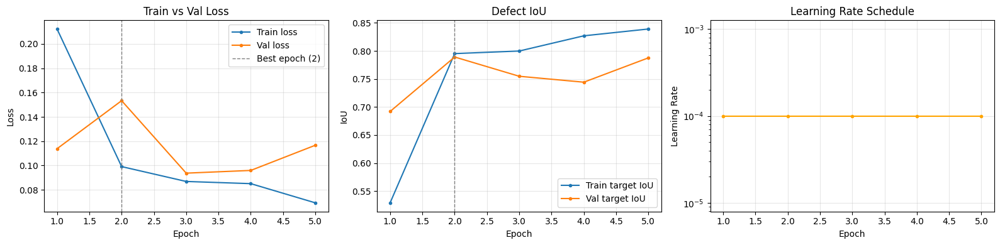

### Step I. Visualise val predictions

Loads the best checkpoint and produces 3-panel figures (**original patch / ground truth / U-Net prediction**) for every validation patch, saving them under `unet_visualizations/val/`. This is your main qualitative diagnostic — look for missed small defects, false positives in clean lattice regions, and noisy mask boundaries.

```python
import matplotlib.pyplot as plt
import matplotlib.patches as mpatches
import os

# 2-class palette: background, defect
PALETTE = np.array([
    [0,   0,   0  ],   # 0 background - black
    [255, 255, 0  ],   # 1 defect     - yellow
], dtype=np.uint8)

def mask_to_rgb(mask):
    display = mask
    display = np.clip(display, 0, len(PALETTE) - 1)
    return PALETTE[display]


def visualize_unet(model, loader, device, save_dir='unet_visualizations/val', show=True):
    os.makedirs(save_dir, exist_ok=True)
    model.eval()
    count = 0

    with torch.no_grad():
        for x, y, names in loader:
            x = x.to(device)
            logits = model(x)
            preds = decode_predictions(logits).cpu().numpy()
            y_np  = y.numpy()

            for i in range(x.shape[0]):
                img  = x[i, 0].cpu().numpy()
                gt   = mask_to_rgb(y_np[i])
                pred = mask_to_rgb(preds[i])

                fig, axes = plt.subplots(1, 3, figsize=(12, 4))
                axes[0].imshow(img,  cmap='gray'); axes[0].set_title(names[i]);           axes[0].axis('off')
                axes[1].imshow(gt);                axes[1].set_title('Ground Truth');     axes[1].axis('off')
                axes[2].imshow(pred);              axes[2].set_title('U-Net Prediction'); axes[2].axis('off')

                patches = [mpatches.Patch(color=np.array(c)/255, label=n)
                           for n, c in zip(CLASS_NAMES[1:], PALETTE[1:])]
                axes[2].legend(handles=patches, loc='lower right', fontsize=7)

                plt.tight_layout()
                plt.savefig(os.path.join(save_dir, names[i].replace('.png', '_viz.png')),
                            dpi=200, bbox_inches='tight')
                count += 1
                if show:
                    plt.show()
                else:
                    plt.close()

    print(f'Saved {count} visualisations to {save_dir}')


model.load_state_dict(torch.load('unet_best.pt', map_location=device))
visualize_unet(model, val_loader, device, show=True)
```

Expected output — 3-panel figures per validation patch (original / ground truth / U-Net prediction):

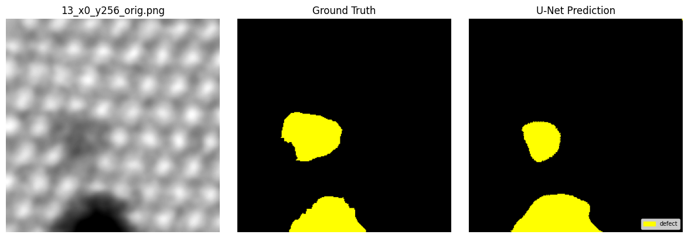

### Step J. Per-class IoU on validation set

Computes the per-class IoU on the full validation set and prints the headline **mean defect IoU** — this is the number the 20 improvement points are graded against. Anything substantially above the baseline counts as progress.

```python
# ============================================================
# Per-class IoU on validation set
# ============================================================

def compute_iou(model, loader, device, num_classes):
    model.eval()
    intersection = torch.zeros(num_classes, dtype=torch.float64)
    union = torch.zeros(num_classes, dtype=torch.float64)

    with torch.no_grad():
        for x, y, _ in loader:
            x = x.to(device, non_blocking=pin_memory)
            pred = decode_predictions(model(x)).cpu()
            y_cpu = y.cpu()
            for c in range(num_classes):
                p = pred == c
                t = y_cpu == c
                intersection[c] += (p & t).sum().item()
                union[c] += (p | t).sum().item()

    return intersection / union.clamp_min(1.0)


iou = compute_iou(model, val_loader, device, NUM_CLASSES)
print('\nPer-class IoU (validation):')
for c, name in enumerate(CLASS_NAMES):
    print(f'  Class {c} ({name}): {iou[c]:.4f}')
print(f'  Mean IoU (defect): {iou[list(TARGET_CLASS_IDS)].mean():.4f}')
```

Expected output — per-class IoU on the validation set:

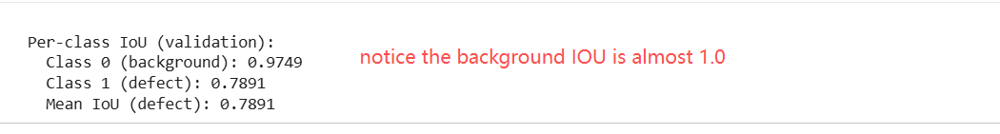

---

# Part 3 — U-Net Prediction on Unlabeled Test Images

In Part 3, you will load the best U-Net weights saved in Part 2 (`unet_best.pt`) and run inference on the unlabeled test images (`2.png` through `12.png`) in `mos2_test_images_unlabeled/`. For each image, the notebook saves and displays a two-panel figure — the **original image on the left** and the **predicted defect mask on the right** — and writes the bare predicted mask to disk as a separate PNG. These qualitative results, together with your validation IoU from Part 2, are what graders use to judge the improvement portion of your submission.

### Step A. Imports + paths

Sets up Part 3: imports, the test image source folder (`mos2_test_images_unlabeled`), the list of test image IDs (`2`–`12`), the saved-weights path (`unet_best.pt`), and a fresh save directory for the inference visualisations.

```python
import os
from pathlib import Path

import numpy as np
import torch
import torch.nn as nn
import torch.nn.functional as F
from PIL import Image
import matplotlib.pyplot as plt
import matplotlib.patches as mpatches
import torchvision.transforms as T

NUM_CLASSES = 2
CLASS_NAMES = ['background', 'defect']
CLASS_CONFIDENCE_THRESHOLDS = {1: 0.50}

SOURCE_DIR = Path('mos2_test_images_unlabeled')
TEST_IMAGE_IDS = [2, 3, 4, 5, 6, 7, 8, 9, 10, 11, 12]  # unlabeled test images
MODEL_PATH = Path('unet_best.pt')
SAVE_DIR = Path('unet_visualizations/test_on_new_images')
SAVE_DIR.mkdir(parents=True, exist_ok=True)

if torch.backends.mps.is_available():
    device = torch.device('mps')
elif torch.cuda.is_available():
    device = torch.device('cuda')
else:
    device = torch.device('cpu')

print('Using device:', device)
print('Saving plots to:', SAVE_DIR)
```

### Step B. Re-define U-Net (standalone for inference)

Re-declares the same `DoubleConv` and `UNet` classes from Part 2 so that **Part 3 can be run standalone** (e.g. on a fresh kernel) without re-running the training cells. The architecture must match exactly so the saved `unet_best.pt` weights load cleanly.

```python
def make_group_norm(num_channels, max_groups=8):
    groups = min(max_groups, num_channels)
    while num_channels % groups != 0:
        groups -= 1
    return nn.GroupNorm(groups, num_channels)


class DoubleConv(nn.Module):
    def __init__(self, in_c, out_c, dropout=0.0):
        super().__init__()
        layers = [
            nn.Conv2d(in_c, out_c, 3, padding=1, bias=False),
            make_group_norm(out_c),
            nn.ReLU(inplace=True),
            nn.Conv2d(out_c, out_c, 3, padding=1, bias=False),
            make_group_norm(out_c),
            nn.ReLU(inplace=True),
        ]
        if dropout > 0:
            layers.append(nn.Dropout2d(dropout))
        self.net = nn.Sequential(*layers)

    def forward(self, x):
        return self.net(x)


class UNet(nn.Module):
    def __init__(self, num_classes):
        super().__init__()
        self.pool = nn.MaxPool2d(2)

        self.d1 = DoubleConv(1, 32)
        self.d2 = DoubleConv(32, 64)
        self.d3 = DoubleConv(64, 128)
        self.d4 = DoubleConv(128, 256, dropout=0.10)
        self.bottleneck = DoubleConv(256, 512, dropout=0.25)

        self.u4 = nn.ConvTranspose2d(512, 256, 2, stride=2)
        self.uconv4 = DoubleConv(512, 256, dropout=0.10)
        self.u3 = nn.ConvTranspose2d(256, 128, 2, stride=2)
        self.uconv3 = DoubleConv(256, 128)
        self.u2 = nn.ConvTranspose2d(128, 64, 2, stride=2)
        self.uconv2 = DoubleConv(128, 64)
        self.u1 = nn.ConvTranspose2d(64, 32, 2, stride=2)
        self.uconv1 = DoubleConv(64, 32)

        self.out = nn.Conv2d(32, num_classes, 1)

    def forward(self, x):
        c1 = self.d1(x)
        c2 = self.d2(self.pool(c1))
        c3 = self.d3(self.pool(c2))
        c4 = self.d4(self.pool(c3))
        bn = self.bottleneck(self.pool(c4))

        x = self.uconv4(torch.cat([self.u4(bn), c4], dim=1))
        x = self.uconv3(torch.cat([self.u3(x), c3], dim=1))
        x = self.uconv2(torch.cat([self.u2(x), c2], dim=1))
        x = self.uconv1(torch.cat([self.u1(x), c1], dim=1))

        return self.out(x)
```

### Step C. Load weights

Loads the best checkpoint from Part 2 (`unet_best.pt`) into the inference model and switches it to `.eval()` mode. If you see a `FileNotFoundError`, you haven't trained the model yet — run Part 2 first.

```python
if not MODEL_PATH.exists():
    raise FileNotFoundError(f'Model weights not found: {MODEL_PATH}')

model = UNet(num_classes=NUM_CLASSES).to(device)
try:
    state_dict = torch.load(MODEL_PATH, map_location=device, weights_only=True)
except TypeError:
    state_dict = torch.load(MODEL_PATH, map_location=device)
model.load_state_dict(state_dict)
model.eval()

print(f'Loaded model weights from {MODEL_PATH}')
```

Expected output — confirmation that the best checkpoint was loaded:

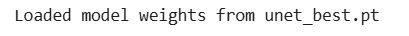

### Step D. Prediction helpers

The U-Net downsamples four times, so each input image must be padded to a multiple of 16 before prediction; after inference, the mask is cropped back to the original size.

Helpers for **full-image** inference (no patching at test time): `decode_predictions` applies the per-class confidence threshold, `pad_to_multiple` reflect-pads the input to a multiple of 16 (since the U-Net halves resolution 4 times), and `predict_image` runs the model and crops the mask back to the original size. `mask_to_rgb` colourises the mask for plotting.

```python
img_tf = T.ToTensor()

PALETTE = np.array([
    [0, 0, 0],       # background
    [255, 255, 0],   # defect
], dtype=np.uint8)


def decode_predictions(logits, class_thresholds=CLASS_CONFIDENCE_THRESHOLDS):
    probs = F.softmax(logits, dim=1)
    confidence, preds = probs.max(dim=1)
    preds = preds.clone()
    for class_idx, threshold in class_thresholds.items():
        preds[(preds == class_idx) & (confidence < threshold)] = 0
    return preds


def pad_to_multiple(x, multiple=16):
    _, _, h, w = x.shape
    pad_h = (multiple - h % multiple) % multiple
    pad_w = (multiple - w % multiple) % multiple
    if pad_h == 0 and pad_w == 0:
        return x, (h, w)
    return F.pad(x, (0, pad_w, 0, pad_h), mode='reflect'), (h, w)


def mask_to_rgb(mask):
    mask = np.clip(mask, 0, len(PALETTE) - 1)
    return PALETTE[mask]


def predict_image(image_path):
    display_image = Image.open(image_path).convert('RGB')
    model_image = display_image.convert('L')
    x = img_tf(model_image).unsqueeze(0).to(device)
    x, (orig_h, orig_w) = pad_to_multiple(x, multiple=16)

    with torch.no_grad():
        logits = model(x)
        pred = decode_predictions(logits)[0, :orig_h, :orig_w].cpu().numpy().astype(np.uint8)
        defect_prob = F.softmax(logits, dim=1)[0, 1, :orig_h, :orig_w].cpu().numpy()

    return np.array(display_image), pred, defect_prob


def find_image_path(image_id, source_dir=SOURCE_DIR):
    extensions = ['.png', '.jpg', '.jpeg', '.tif', '.tiff', '.bmp']
    for ext in extensions:
        candidate = source_dir / f'{image_id}{ext}'
        if candidate.exists():
            return candidate
    raise FileNotFoundError(f'Could not find image {image_id} in {source_dir}')
```

### Step E. Run predictions on unlabeled images #2–12

Iterates over the unlabeled test images (`2.png` … `12.png`), runs U-Net inference on each, saves the predicted mask as a standalone PNG (`*_pred_mask.png`), and shows a 2-panel figure (**Original vs Predicted defect mask**). The printed `defect pixels` count makes it easy to spot images where the model is mis-firing (zero pixels on a clearly defective image, or millions of pixels on a clean one).

```python
patches = [mpatches.Patch(color=np.array(PALETTE[1]) / 255, label='defect')]

for image_id in TEST_IMAGE_IDS:
    image_path = find_image_path(image_id)
    image, pred_mask, defect_prob = predict_image(image_path)

    mask_path = SAVE_DIR / f'{image_path.stem}_pred_mask.png'
    Image.fromarray(mask_to_rgb(pred_mask)).save(mask_path)

    fig, axes = plt.subplots(1, 2, figsize=(10, 5))
    axes[0].imshow(image)
    axes[0].set_title(f'Original: {image_path.name}')
    axes[0].axis('off')

    axes[1].imshow(mask_to_rgb(pred_mask))
    axes[1].set_title('Predicted defect mask')
    axes[1].axis('off')
    axes[1].legend(handles=patches, loc='lower right', fontsize=8)

    plt.tight_layout()
    plot_path = SAVE_DIR / f'{image_path.stem}_original_vs_pred_mask.png'
    plt.savefig(plot_path, dpi=200, bbox_inches='tight')
    plt.show()

    defect_pixels = int((pred_mask == 1).sum())
    print(f'{image_path.name}: saved {plot_path}; defect pixels = {defect_pixels:,}')
```

Expected output — original-vs-predicted-mask figures for each unlabeled test image, with the defect pixel count printed below:

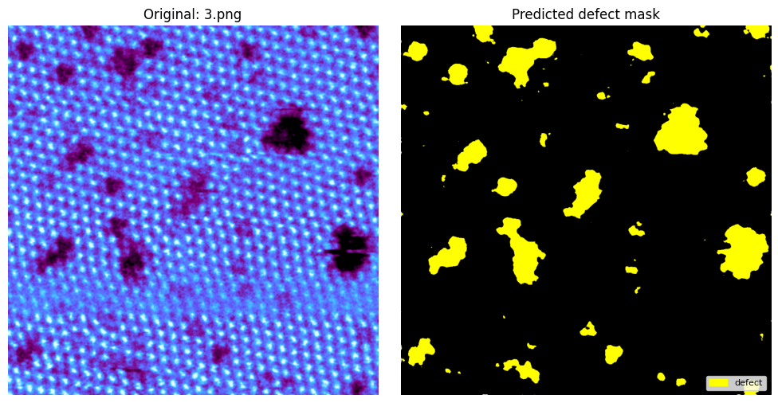

---

### Optional — Note on GPU VRAM usage

While training is running, hover over the **RAM / Disk** indicator in the top-right of Colab (or open `Runtime → View resources`) to watch how much of the T4's 15 GB of VRAM the U-Net is consuming. If you bump `BATCH_SIZE` or `PATCH` and run out of memory, you'll see an `OutOfMemoryError` — drop the batch size back down or restart the runtime to clear the GPU.

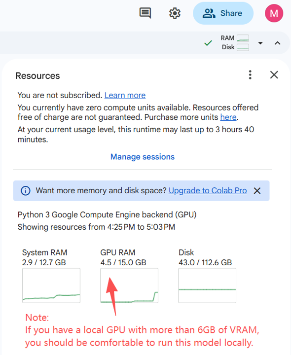

---

# Questions & Answering (8 × 10 pts = 80 pts)

For each question below, copy the markdown block into a **new markdown cell** in your `.ipynb`, then write your answer in a second markdown cell directly below it.

### Question 1 *(10 pts)*

````markdown
### Question 1 *(10 pts)*

Why do we need **train-validation-split** before U-Net training?

*Your answer:*
````

### Question 2 *(10 pts)*

````markdown
### Question 2 *(10 pts)*

Why crop original images into **smaller patches**?

*Your answer:*
````

### Question 3 *(10 pts)*

````markdown
### Question 3 *(10 pts)*

Why is **image augmentation** needed, and what other methods could be used?

*Your answer:*
````

### Question 4 *(10 pts)*

````markdown
### Question 4 *(10 pts)*

How do we address the **class imbalance** (background ≫ defect)?

*Your answer:*
````

### Question 5 *(10 pts)*

````markdown
### Question 5 *(10 pts)*

Explain the **U-Net architecture & skip connections**, and why they are crucial for pixel-wise segmentation.

*Your answer:*
````

### Question 6 *(10 pts)*

````markdown
### Question 6 *(10 pts)*

Describe the **loss function(s)** and **evaluation metric(s)** used in this notebook.

*Your answer:*
````

### Question 7 *(10 pts)*

````markdown
### Question 7 *(10 pts)*

What are the key **hyperparameters** you can fine-tune to improve performance?

*Your answer:*
````

### Question 8 *(10 pts)*

````markdown
### Question 8 *(10 pts)*

**Evaluate** the current training history and test results — is it good? If not, how can it be improved?

*Your answer:*
````

---

### Improvement — **20 pts**

Apply your improvement plan from Q8 (modify code, label more images, tune hyperparameters, etc.) and re-run. Points are awarded based on how much your final **defect IoU** exceeds the baseline, and on the visual cleanliness of predicted masks on the unlabeled test images.

---

### Submission

- Upload your updated `.ipynb` with every question answered (80%).
- U-Net performance improved with new results shown in the notebook (20%).

(The End)

---

## References

- Ronneberger, O., Fischer, P., & Brox, T. (2015). *U-Net: Convolutional Networks for Biomedical Image Segmentation*. MICCAI. [https://lmb.informatik.uni-freiburg.de/people/ronneber/u-net/](https://lmb.informatik.uni-freiburg.de/people/ronneber/u-net/)
- Hong, J., Hu, Z., Probert, M., Li, K., Lv, D., Yang, X., Gu, L., Mao, N., Feng, Q., Xie, L., Zhang, J., Wu, D., Zhang, Z., Jin, C., Ji, W., Zhang, X., Yuan, J., & Zhang, Z. (2015). *Exploring atomic defects in molybdenum disulphide monolayers*. Nature Communications, 6(1), 6293. [https://doi.org/10.1038/ncomms7293](https://doi.org/10.1038/ncomms7293)
- Wikipedia — Image segmentation — [https://en.wikipedia.org/wiki/Image_segmentation](https://en.wikipedia.org/wiki/Image_segmentation)
- Towards Data Science — Intersection over Union (IoU) — [https://towardsdatascience.com/intersection-over-union-iou-calculation-for-evaluating-an-image-segmentation-model-8b22e2e84686/](https://towardsdatascience.com/intersection-over-union-iou-calculation-for-evaluating-an-image-segmentation-model-8b22e2e84686/)
- LabelMe — [https://labelme.io/docs/install-labelme-terminal#install-uv-and-python](https://labelme.io/docs/install-labelme-terminal#install-uv-and-python)
- Google Colab — [https://colab.research.google.com/](https://colab.research.google.com/)
- Miniconda — [https://docs.anaconda.com/miniconda/](https://docs.anaconda.com/miniconda/)
- PyTorch (install selector) — [https://pytorch.org/get-started/locally/](https://pytorch.org/get-started/locally/)
- uv (Astral) — [https://astral.sh/uv](https://astral.sh/uv)

---

## Disclaimer

The code in this repository (the notebook cells, helper functions, and accompanying README descriptions) was generated with the assistance of **ChatGPT (OpenAI)** and **Claude Code (Anthropic)**, working from pre-defined instructions and prompts written by the instructors. All AI-generated content has been reviewed, tested, and adapted by the instructors for use in this class. Students are expected to read, understand, and modify the code to answer the assignment questions and improve model performance.
